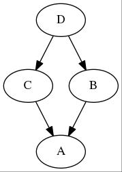

前面开始讲述了`构造函数`、`赋值函数`以及`析构函数`，在讲述`条款5`时稍微展开讨论了一下细节，没想到篇幅会变长，看来之后有关`Effective C++`每篇博客的讨论的条款数量不定，只能以篇幅来限制，所以这个系列会有多少片，笔者也不清楚，碰到一些比较熟悉的条款应用就展开多讨论一些。

## 条款7:为多态基类声明virtual析构函数

这里涉及到面向对象中的`多态`这个性质，假设有如下继承关系，`Base`基类的析构函数为非虚函数:
``` c++
class Base
{
public:
	~Base()
	{
		cout << "Base::~Base(this=" << this << ")" << endl;
	}
};

class Derived : public Base
{
public:
	~Derived()
	{
		cout << "Derived:~Derived(this=" << this << ")" << endl;
	}
};
```
在析构函数中输出一些信息，有如下的`main`:
``` c++
int main(int argc, char* argv[])
{
	Base* b = new Base();

    Derived* d = new Derived();

    delete b;

    delete d;

    cout << "--------Stg--------" << endl;

    b = new Derived();

    d = new Derived();

    delete b;

    delete d;
}
```
会得到如下的输出:
``` text
Base::~Base(this=0x1d04c20)
Derived:~Derived(this=0x1d04c40)
Base::~Base(this=0x1d04c40)
--------Stg--------
Base::~Base(this=0x1d04c40)
Derived:~Derived(this=0x1d04c20)
Base::~Base(this=0x1d04c20)
```
首先看到第一个由`Derived`指针指向的对象只执行了`Dervied`自身的析构函数，随后正确执行了`Base`部分的析构。

然后因为上一个对象被回收了，导致下一个创建出来的对象用了上一个对象的地址，笔者在此加了一行输出隔开。用一个`Base`指针指向的`Derived`对象，其地址与上一个`Derived`对象一致，然而输出分割线下这个`Base`指向，实际为`Dervied`对象只执行`Base`部分的析构，这样就造成了`Derived`部分的内存泄漏了。

随后修改`Base`:
``` c++
class Base
{
public:
	virtual ~Base()
	{
		cout << "Base::~Base(this=" << this << ")" << endl;
	}
};
```
不改动`main`代码，编译执行，得到如下的输出:
``` text
Base::~Base(this=0x1156c20)
Derived:~Derived(this=0x1156c40)
Base::~Base(this=0x1156c40)
--------Stg--------
Derived:~Derived(this=0x1156c40)
Base::~Base(this=0x1156c40)
Derived:~Derived(this=0x1156c20)
Base::~Base(this=0x1156c20)
```
第三个new出来，由`Base`指针指向的`Derived`对象正确地按照`Derived::~Derived()`、`Base::~Base()`顺序析构了这个对象。

虽然书上给出的心得:"只有当class内含至少一个virtual函数，才为它声明virtual析构函数"，但是笔者认为这只是一个明显的信号，在实践中，一般能够通过分析得出该类是否会被继承，这时候就可以为其声明virtual析构函数了。

注意<font color="red">std::string的析构函数是non-virtual的</font>，所以把std::string作为基类编写自定义类的时候是一个不明智的行为。

书中提到了如果一个带有纯虚析构函数的基类，其声明纯虚函数的作用是为标记此类为抽象类，但是其析构函数仍然具有行为，则可以在声明其纯虚析构函数后继续给出定义:
``` c++
class AWOV 		// Abstract w/o Virtuals
{
public:
	virtual ~AWOV() = 0;
}

AWOV::~AWOV()
{}
```
这样即使抽象类具有数据成员时，因其纯虚的析构函数具有定义，也可执行析构函数成功进行析构动作。

当一个类中带一个纯虚函数的时候，那么该类就是一个抽象类，是不可实例化的。讲到这里，笔者觉得需要与`Java`的类继承机制作为对比，`Java`只允许单继承，而允许多实现，例如:
``` java
class Base
{...}

interface FunPack1
{...}

interface FunPack2
{...}

class Dervied extends Base implements FunPack1, FunPack2
{...}
```
单继承纵然会限制了语言的灵活性，多继承存在如下的问题:


如果`~A()`是一个虚函数，那么一个`D`的实例被`delete`的时候其`A`部分会被析构几次？这个问题可以在对象模型中找到答案，这里就不展开细说。单继承是为了解决多继承的一些缺点，但是从`Java`多接口实现来看，事实上是多继承的功能的子集，`Java`的接口只允许声明方法的签名以及一些静态量，当用这个接口类型‘指向’其实现的对象时，则可以调用该接口声明的函数，实施一些行为。

笔者在此不是对比单继承多继承的优缺点，而是说明通过限制`C++`多继承可以模拟`Java`的这种方式，提供了面向对象设计的一种思路。毕竟正是因为`C++`的多样的语法导致其编程人员的上限可以很高，也可以很低，当项目集成的时候容易出现致命问题，所以在真正的`C++`项目中会事先做好一些约束。

也就是说，当多继承容易出问题的时候，不妨考虑约束拥有纯虚函数的基类不得拥有成员变量，使之成为一个仅仅声明纯虚函数接口的接口类，而且在后来的条款也会建议，可以用`组合`设计模式解决问题的时候就不考虑`继承`。以此为原则，基本上可以解决很多问题，起码在笔者的经历中还没碰到过非得用上述`菱形`继承的问题。

## 条款8:别让异常逃离析构函数

相比起`Java`，`C++`在`异常处理`有着巨大的劣势，毕竟观察`C++`的发展历程，像是`C`为了跟上时代而制作的一门语言。毕竟作为一门历史比较悠久的语言，一方面要兼容`C`，一方面又不能在功能上落后于时代，就如较为前卫的`python`、`ruby`的`lambda`、`Duck Type`等语言特性，`C++11`才加入了`lambda`表达式以及`auto`关键字，而内存管理只能妥协于种种理由出了`memory`系列，`C++1x`还在探讨`import`部分导入代替现在的`include`整个文件导入。

说回异常，`Java`在异常发生的时候会显式地抛出异常并输出调用栈，这对于`debug`过程来说虽然信息冗长，但是花点时间审查信息的话总能筛选出有效的信息来调试程序。`Java`编译会强制要求处理一些可能抛出的异常，好一点的`IDE`会在写代码的时候就提示补全。而`C++`无论写什么都好，对于可能抛出异常的地方编译器也不会在编译期提醒。到了真正抛出异常的时候，就简单地输出一句调用"what()"的信息，没有调用栈信息，有点经验的就在很可能出现问题的代码出使用`gdb`插入断点等手段验证是不是这里出问题。

不过这只是强行用`C++`来做`面向异常的编程`的缺点，事实上异常是瘸腿的话，那么就不用了，大面积使用异常处理的`C++`项目确实也不常见。

书上介绍了场景，最后给出如下的代码方案:
``` c++
class DBConn
{
public:
	...
	void close()
	{
		db.close();
		closed = true;
	}
	~DBConn()
	{
		if(!closed)
		{
			try{
				db.close();
			}
			catch(...)
			{
				写log或者吞下异常。
			}
		}
	}
private:
	DBConnection db;
	bool closed;
}
```
这样的话，析构函数只是起了用户忘记关闭连接的时候做善后处理的作用，而调用`db.close()`时候要是出问题也很大可能是在用户手动调用的时候，要是析构的时候也出异常了，证明程序或者环境配置有问题了，前提是第一次关闭的代码出异常的时候程序还能继续正常运行下去，是用户必须自己去处理的事了。

书上也划了个重点:
#### 析构函数绝对不要吐出异常。

## 条款9:绝不在构造和析构过程中调用virtual函数

这个条款很好理解，先来看看书上的例子，笔者稍微修改了一些实例代码用于演示:
``` c++
class Transaction{
public:
	Transaction()
	{
		...
		logTransaction();
	}
	virtual void logTransaction()
    {
        cout << "Transaction::logTransaction()" << endl;
    }
    ...
}

class BuyTransaction : public Transaction{
public:
	virtual void logTransaction() const
	{
		cout << "BuyTransaction::logTransaction()" << endl;
	}
	...
}

class SellTransaction : public Transaction{
public:
	virtual void logTransaction() const
	{...}
	...
}
```
当定义一个`BuyTransaction`实例时，其`Transaction::Transaction()`构造过程首先被调用，运行程序会看到输出:
``` text
Transaction::logTransaction()
```
查看编译器为`BuyTransaction`生成的汇编:
``` asm
BuyTransaction::BuyTransaction():
        pushq   %rbp
        movq    %rsp, %rbp
        subq    $16, %rsp
        movq    %rdi, -8(%rbp)
        movq    -8(%rbp), %rax
        movq    %rax, %rdi
        call    Transaction::Transaction()
        movl    vtable for BuyTransaction+16, %edx
        movq    -8(%rbp), %rax
        movq    %rdx, (%rax)
        nop
        leave
        ret
```
可以一目了然地看到这个构造函数先调用了`Transaction::Transaction()`之后再构造`BuyTransaction`实例的`vtbl`指针，在此之前这个实例是无法获取得到`BuyTransaction`中的`logTransaction()`的地址。

书上给出的解决方案是将`logTransaction`的属性更改为`non-virtual`，这个是无懈可击的。但是在笔者的实际应用当中，更多的时候构造函数仅仅只是作为初始化成员变量，最多调用非成员函数用于辅助初始化成员，需要具体的操作就等使用者根据自己的需要调用，最坏的情况也只能是在构造函数中调用`non-virtual`的成员函数。