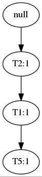
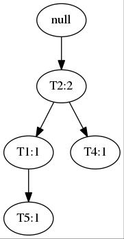

之前实现了`Apriori`算法()，但是该算法存在着不少的算法性能缺陷，例如光是产生候选集都有这么多$\sum_{i=1}^{K}C_n^i$，加上用了平凡方式实现的原因，存储候选集产生了不少额外的内存使用。而`FP-growth`中的`FP-tree`则是用于压缩这些候选集的存储空间，候选集间会共享相同的元素。例如`{A,B,C}`和`{A,B,D}`，在`Apriori`中是单独的记录，而在`FP-growth`中用树存储，它们会共享`{A,B}`这个父节点，然后产生`{C}`和`{D}`两个子节点，当模式越长的时候，这种压缩方法带来的存储开销优化越明显。

当然为了能够构造这样的树，还要设计额外的算法构建这棵树，一旦`FP-tree`构建了起来，检索方式就特别方便了，这个例子是典型的牺牲算法复杂度换取存储复杂度的例子。

## 样例数据集

`FP-growth`算法过程比`Apriori`还复杂，需要用一个例子来引导学习者。这里用的是《数据挖掘概念与技术》中的例子。

| 单号 | 购物清单 |
|:---:|:----:|
|T100 | I1,I2,I5 |
|T200 | I2,I4 |
|T300 | I2,I3 |
|T400 | I1,I2,I4 |
|T500 | I1,I3 |
|T600 | I2,I3 |
|T700 | I1,I3 |
|T800 | I1,I2,I3,I5|
|T900 | I1,I2,I3 |

## 生成FP-tree

第一步与`Apriori`一样，根据最小支持度产生`1`项集。按照上述的样例数据，可产生:

|项集|支持度计数|
|:-:|:-------:|
|{I1}| 6 |
|{I2}| 7 |
|{I3}| 6 |
|{I4}| 2 |
|{I5}| 2 |

但是`FP-growth`在此开始就不产生`2`以上的候选集了。首先按照频数给频繁集排序:{I2:7, I1:6, I3:6, I4:2, I5:2}。以`null`创建`FP-tree`的根。

随后扫描每条事务，按照排过序的频繁集读入一条事务。例如读入`T100`将产生:


再读入`T200`:


这样，两条事务就共享了一个前缀`T2`，通过同样的方法，最终构建出一棵`FP-tree`:


左边的表用于记录频繁集散布在树的位置。

这样生成树之后，只要从树的叶子节点开始，或者从根节点开始，只要设定好支持度阈值或其他参数，都能频繁树中获得目标模式。

## 伪代码

``` code
算法 FP-Growth。使用FP树，通过模式增长挖掘频繁模式。
输入:
	D: 事务数据库。
	min_sup: 最小支持度阈值。
输出:
	频繁模式的完全集。
方法:
1.按以下步骤构造FP树:
	(a)扫描事务数据库D一次。收集频繁项集的集合F和它们的支持度计数。对F按支持度计数降序排序，结果为频繁项列表L。
	(b)创建FP树的根节点，以"null"标记它。对于D中每个事务Trans，执行:
	   选择Trans中的频繁项，并按L中的次序排序。设Trans排序后的频繁项列表为[p|P]，其中p是第一个元素，而P是剩余元素的列表。调用insert_tree([p|P], T)。该过程执行情况如下。如果T有子女N使得N.item-name=p.item-name，则N的计数增加1;否则，创建一个新结点N，将其计数设置为1,链接到它的父结点T,并且通过结点链结构将其链接到具有相同item-name的结点。如果P非空，则递归地调用insert_tree(P,N)。
2.FP树的挖掘通过调用FP_growth(FP_tree, null)实现。该实现过程如下。
	procedure FP_growth(Tree, α)
		if Tree 包含单个路径 P then
			for 路径 P 中结点的每个组合(记作β)
				产生模式α ∪ β，其支持度计数support_count等于β中结点的最小支持度计数;
		else
			for Tree的表头的每个ai
			{
				产生一个模式β = α ∪ ai，其支持度技术support_count=ai.support_count;
				构造β的条件模式基，然后构造β的条件FP树Treeβ;
				if Treeβ！=Empty Set then
					调用FP_growth(Treeβ, β);
			}
```

## Python实现

先从定义`FpTreeNode`开始:
``` python
class FpTreeNode:
    def __init__(self, layer, node_tag='', val=0, parent=None, child_list=None):
        if child_list is None:					# 有不定个子结点。
            child_list = []

        self.layer = layer

        self.node_tag = node_tag

        self.val = val

        self.parent = parent

        self.child_list = child_list

    def increase_val(self, inc_val=1):
        self.val += inc_val

    def add_child_node(self, child_node):
        self.child_list.append(child_node)

    def __str__(self):
        return 'Node Name: %s, Value: %d' % (self.node_tag, self.val)
```
然后定义`FpTree`:
``` python
class FpTree:
    def __init__(self, fre_list):
        self.root = FpTreeNode(layer=0, node_tag='null')	# 根结点。

        self.fre_list = fre_list

        self.lnk_tbl = None

    def rearrange_ptn_as_fre_list(self, ptn):				# 对进来的记录按照频繁集中的顺序重新排列。

        rearranged_record = []

        for (key, val) in self.fre_list:

            if key in ptn:

                rearranged_record.append(key)

        return rearranged_record

    def absorb_pattern(self, ptn, cnt):						# 处理进来的一条记录。

        tree_iter = self.root

        layer_count = 0

        ptn = self.rearrange_ptn_as_fre_list(ptn)			# 排序。

        for ele in ptn:

            next_node = None

            for child_node in tree_iter.child_list:			# 查找前缀是否已存在。

                if child_node.node_tag == ele:

                    child_node.increase_val(cnt)			# 存在则直接增加结点的计数值。

                    next_node = child_node

                    break

            if next_node is None:							# 需要产生新的结点。

                next_node = FpTreeNode(layer=layer_count + 1, node_tag=ele, val=cnt, parent=tree_iter)

                tree_iter.add_child_node(next_node)			# 增加子结点。

            tree_iter = next_node							# 进入子结点。

            layer_count += 1

    def gen_link_tbl(self):									# 产生FP树的时候，需要记录频繁集结点的分布。

        link_tbl = {}										# 以便快速检索。

        for (key, val) in self.fre_list:

            link_tbl[key] = [val]

        queue = []

        for node in self.root.child_list:

            queue.append(node)

        while len(queue) > 0:								# BFS遍历。

            node = queue[0]

            queue.pop(0)

            for child_node in node.child_list:

                queue.append(child_node)

            link_tbl[node.node_tag].append(node)			# 添加结点位置记录，用item ID作为字典的关键字。

        return link_tbl

    def gen_prefix_paths(self, key, update_lnk_tbl=False):	# 产生前缀路径。

        if self.lnk_tbl is None or update_lnk_tbl:			# 获得频繁集中的结点分布。

            self.lnk_tbl = self.gen_link_tbl()

        prefix_paths = {}

        for node in self.lnk_tbl[key][1::]:					# 链表中第一个元素是频繁集支持度，所以索引从1开始。

            node_iter = node.parent 						# 自下向上获取前缀。

            prefix_path = set()

            while node_iter.node_tag != 'null':

                prefix_path.add(node_iter.node_tag)

                node_iter = node_iter.parent

            if len(prefix_path) > 0: prefix_paths[frozenset(prefix_path)] = node.val 	# 路径的支持度是路径中的结点的最小支持度。如果路径存在频繁项，则添加到结果中。

        return prefix_paths

    def is_empty(self):

        return True if len(self.root.child_list) < 1 else False
```
生成`FP-Tree`:
``` python
def gen_fp_tree(dataset, min_sup=1):

    frequent_list = find_frequent_1_itemsets(dataset, min_sup)			# 产生1频繁项集。

    frequent_list = sorted(frequent_list.items(), key=lambda d: d[1], reverse=True)	# 降序排序。

    fp_tree = FpTree(frequent_list)										# 注入到树中。

    for record, cnt in data_set.items():								# 把事务数据注入到树中，挖掘频繁模式。

        fp_tree.absorb_pattern(record, cnt)

    return fp_tree
```
生成了树之后，就可以调用`FP_growth`生成频繁模式了:
``` python
def FP_growth(fp_tree, min_sup=1, prefix=None, fre_item_list=None):

    if fre_item_list is None:

        fre_item_list = {}

    if prefix is None:

        prefix = set()

    for base_ptn, val in fp_tree.fre_list:			# 自上向下扫描FP-tree。

        new_fre_set = prefix.copy()					# 前缀也按一层一层地增长。

        new_fre_set.add(base_ptn)					# 以上一层生成的前缀为基础。

        fre_item_list[frozenset(new_fre_set)] = val 	# 设置该频繁项集的支持度。

        cond_ptn_bases = fp_tree.gen_prefix_paths(base_ptn)	# 生成前缀路径。

        cond_fp_tree = gen_fp_tree(cond_ptn_bases, min_sup) # 生成条件模式树。

        if not cond_fp_tree.is_empty():						# 递归子结点。

            FP_growth(cond_fp_tree, min_sup, new_fre_set, fre_item_list)

    return fre_item_list
```
代码中涉及到的数据加载以及产生`1`频繁项集的代码都与一致，故本文就没有写上。

在这里要说明的是，在递归向下的时候，条件模式树会被不断地生成，以及生成去掉了前缀元素后的子树，因为暂时没有办法解决在不生成新的条件模式树的情况下，让下一层递归能够正确处理更新后的数据。所以笔者这里是一个可以优化的地方。

至此，`FP-growth`实现完毕。