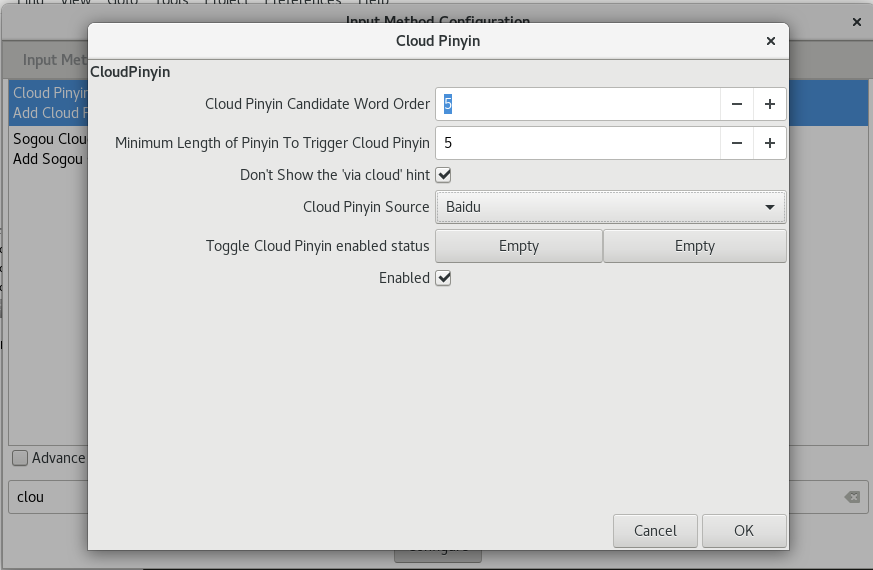

因为之前一直没怎么使用Sublime Text 3做中文输入，没太在意这个部分，但是最近开始了写博客，总不可能一直写英文，Sublime又是我一直用来的编辑器，虽然有点麻烦，但是还是配置起来用。

经过测试，中文输入是支持了，但是我用的FZUG源的搜狗输入法并不稳定，经常会崩溃到无法关机。
后来我换了Google的拼音输入法，目前还未崩溃。

## 环境支持

1. 操作系统为Fedora 25.
1. fcitx
1. Sublime Text 3
1. (可选)懒人可以通过[添加FZUG源](https://github.com/FZUG/repo/wiki/添加-FZUG-源)，然后省去复杂的安装搜狗输入法(<font color="red">不推荐</font>)步骤，细节在接下来内容介绍。

## 卸载iBus，安装fcitx

Fedora一般默认安装的输入法管理器是`iBus`,而如果要把中文输入到Sublime Text 3中，则需要`fcitx`，所以使用
``` bash
$ sudo dnf remove ibus
```
卸载iBus，以及关闭GNOME对iBus的支持:
``` bash
$ gsettings set org.gnome.settings-daemon.plugins.keyboard active false
```

安装fcitx:
``` bash
$ sudo sudo install fcitx fcitx-configtool -y
```

指定输入法模块:
``` bash
$ vim ~/.bashrc
```

在文件末尾添加:
``` code
export GTK_IM_MODULE=fcitx
export QT_IM_MODULE=fcitx
export XMODIFIERS="@im=fcitx"
```

安装中文拼音输入法:
``` bash
$ sudo dnf install fcitx-googlepinyin fcitx-cloudpinyin -y
```

注销或者重启系统，通过`Ctrl+Space`就可以切换输入法。
或者将鼠标指向屏幕左下方，会出现:

点击之后:

选择google输入法:


在配置中选择`Addon`，在底下的搜索栏搜索`cloud`得到`Cloud Pinyin`，双击设置:


修改云拼音源为`baidu`，这样就不会因为被墙而使用不了云拼音。

## 添加插件使得Sublime Text 3支持中文输入

笔者假定Sublime Text 3已经安装好，并且目录为`/opt/sublime-text`。

[下载插件源码](https://github.com/lyfeyaj/sublime-text-imfix/blob/master/src/sublime-imfix.c)

就这个文件就可以了。

执行命令生成动态库:
``` bash
$ gcc -shared -o libsublime-imfix.so sublime-imfix.c `pkg-config --libs --cflags gtk+-2.0` -fPIC
```

<font color="red">注意</font>: 如果编译报错缺失`<gtk/gtk.h>`，证明系统缺少gtk2.0库的支持，执行命令:
``` bash
$ sudo dnf install gtk2-devel -y
```
补全依赖，再次执行编译动态库命令。

先执行:
``` bash
$ LD_PRELOAD=./libsublime-imfix.so sublime_text
```

测试sublime能否支持中文输入，一般都是可以了。
通过的话，执行:
``` bash
$ cp ./libsublime-imfix.so /opt/sublime-text/
```
将动态库复制到sublime的目录下。

之后修改:
``` bash
$ sudo vim /usr/share/applications/sublime_text.desktop
```

将原来的:
``` code
Exec=/opt/sublime-text/sublime_text %F
```
改为:
``` code
Exec=bash -c "LD_PRELOAD=/opt/sublime-text/libsublime-imfix.so exec /opt/sublime-text/sublime_text %F"
```

至此，从GNOME启动sublime text 3可以支持fcitx的中文输入了。

(可选1):修改`/usr/bin/subl`:
``` code
#!/bin/sh
LD_PRELOAD=/opt/sublime-text/libsublime-imfix.so
/opt/sublime-text/sublime_text "$@"
```

(可选2):添加一行到`/etc/profile`:
``` code
LD_PRELOAD=/opt/sublime-text/libsublime-imfix.so
```