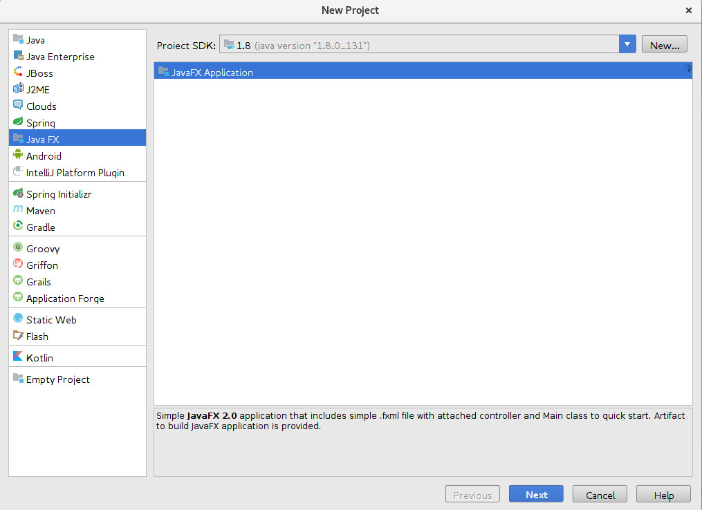
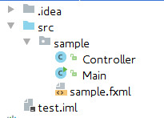

之前一直使用命令行或者Web技术当作用户交互界面的方式，而且刚开始学习编程的时候前人的经验都挺排斥图形界面编程的，以致于自己除了用Web页面方式之外，再也没有别的图形化编程经验。因为最近有些需要，语言要求是Java，在网上浏览之后，决定采用`JavaFX`而不是`Swing`或者`awt`。事实上，也有可能因为笔者Web项目的经验，而这些框架是基于MVC思想的，所以上手很快，就是得花点时间熟悉提供的工具特性。

## 环境支持
1. JDK 1.8

笔者用的IDE是JetBrain IDEA Ultimate 2017.1，所以教程也是依据这个IDE提供的功能进行。

## 创建项目

打开IDEA，创建项目，在如图左侧选择`JavaFX`，一直下一步，项目名一如既往为`test`:

然后IDEA就会根据模板给我们创建好项目:
