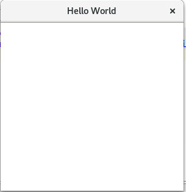
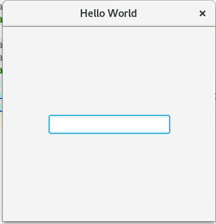
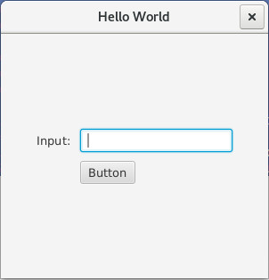
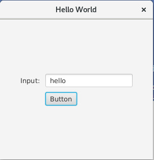
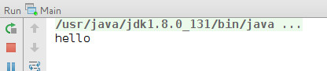
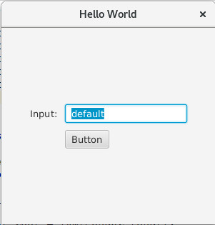
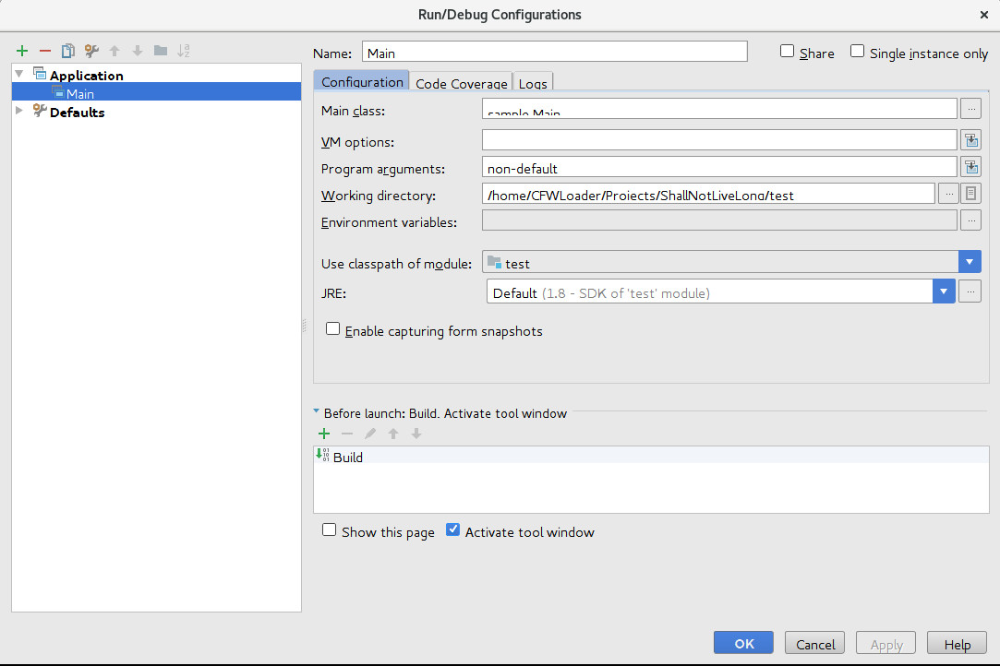
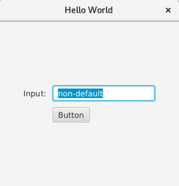

之前一直使用命令行或者Web技术当作用户交互界面的方式，而且刚开始学习编程的时候前人的经验都挺排斥图形界面编程的，以致于自己除了用Web页面方式之外，再也没有别的图形化编程经验。因为最近有些需要，语言要求是Java，在网上浏览之后，决定采用`JavaFX`而不是`Swing`或者`awt`。事实上，也有可能因为笔者Web项目的经验，而这些框架是基于MVC思想的，所以上手很快，就是得花点时间熟悉提供的工具特性。

## 环境支持
1. JDK 1.8

笔者用的IDE是JetBrain IDEA Ultimate 2017.1，所以教程也是依据这个IDE提供的功能进行。

## 创建项目

打开IDEA，创建项目，在如图左侧选择`JavaFX`，一直下一步，项目名一如既往为`test`:


然后IDEA就会根据模板给我们创建好项目:


其中，`src`源码目录下会有一个`sample`的子目录，这个子目录在将来的工程开发即为包的名字，这个细节是后面的事了。`sample`目录下有三个文件:
1. `Controller.java`，上面提到过，这些框架是基于`MVC`思想的，自然而然这个类就是项目的控制器了。当然也跟一般的web项目区别不大， JavaFX项目可以存在多个控制器。但是因为笔者不清楚JavaFX下是否有类似`Spring`这类`IOC`框架，所以控制器的实例化就需要手动操作了。
1. `Main.java`，因为不是web项目，没有容器，所以JavaFX与一般项目一样，需要一个程序的入口，而这里的Main类就承担了这个责任。而且当存在启动参数设置时，尤其是需要传递到应用中，Main类则又承担了应用参数初始化的责任，这些系列将在后面演示。
1. `sample.fxml`，这个就是GUI布局的文件，跟html有一些相似，却又不同，JavaFX指出两种建立GUI的方式，一种是在代码里面用代码的方式初始化GUI的布局，另一种就是用fxml的文件初始化布局。

## FXML界面布局

这里介绍的是用fxml方式初始化界面布局，所谓的与html不同，是因为html提供了一些很直观的方式，例如当你放置一个`tr`在一个`tr`下面的时候，在没有`css`文件针对布局的时候，呈现出来的`tr`就一定是在`tr`下面，即编码的布局与显示的布局绑定了。在IDEA模板中，fxml里面的第一层是一个`GridPane`，将图形界面分为一个一个的格子。IDEA初始化的`sample.fxml`内容:
``` code
<?import javafx.geometry.Insets?>
<?import javafx.scene.layout.GridPane?>

<?import javafx.scene.control.Button?>
<?import javafx.scene.control.Label?>
<GridPane fx:controller="sample.Controller"
          xmlns:fx="http://javafx.com/fxml" alignment="center" hgap="10" vgap="10">
</GridPane>
```
既然是快速入门，先运行一遍项目，可以看到一个空白的窗口:


开始修改图形界面，以加入一个`TextField`为例，试试简单地在`GridPane`里面添加一句`TextField`:
```code
<?import javafx.geometry.Insets?>
<?import javafx.scene.layout.GridPane?>

<?import javafx.scene.control.Button?>
<?import javafx.scene.control.Label?>
<?import javafx.scene.control.TextField?>
<GridPane fx:controller="sample.Controller"
          xmlns:fx="http://javafx.com/fxml" alignment="center" hgap="10" vgap="10">
    <TextField/>
</GridPane>
```
运行得到:


似乎没有什么问题，接下来尝试在这个`TextField`的左边加个显示内容为`Input:`的`Label`以及一个Button，注意这时候就需要给这个`GridPane`内的元素添加`GridPane.rowIndex`和`GridPane.columnIndex`属性来确定元素在里面的位置了，不然笔者猜测可能自动将添加的元素默认为`GridPane.rowIndex=0`和`GridPane.columnIndex=0`然后按照出现的顺序将前面的元素覆盖了。修改后的`sample.fxml`:
``` code
<?import javafx.geometry.Insets?>
<?import javafx.scene.layout.GridPane?>

<?import javafx.scene.control.Button?>
<?import javafx.scene.control.Label?>
<?import javafx.scene.control.TextField?>
<GridPane fx:controller="sample.Controller"
          xmlns:fx="http://javafx.com/fxml" alignment="center" hgap="10" vgap="10">
    <Label text="Input:" GridPane.rowIndex="0" GridPane.columnIndex="0"/>
    <TextField GridPane.rowIndex="0" GridPane.columnIndex="1"/>
    <Button GridPane.rowIndex="1" GridPane.columnIndex="1" text="Button"/>
</GridPane>
```
然后就可以得到一个简易的界面:


由于本文目的是快速构建一个GUI，例如想将两个元素放置入一个`GridPane`中(使用`VBox`)等涉及的更多的布局需求情况暂不在此展开讨论。

## 获取图形界面元素中的值

前面的步骤也只是建立了一个简单的图形界面，但是程序的后台无法获得图形中的界面发生的事件以及元素中的值。这一步将介绍如何获取窗口中`Button`的点击事件，以及获得`TextField`中的值。

首先打开`Controller.java`，IDEA给我们创建了空的内容:
``` code
package sample;

public class Controller {
}
```
因为我们是想获取`TextField`的内容的值，以及`Button`的点击事件，将代码修改如下:
``` code
package sample;

import javafx.event.ActionEvent;
import javafx.fxml.FXML;
import javafx.scene.control.TextField;

public class Controller {

    @FXML
    private TextField textField;

    @FXML
    public void handleButtonAction(ActionEvent actionEvent)
    {
        System.out.println(textField.getText());
    }
}
```
有的教程里面会提示`Controller`需要实现`javafx.fxml.Initializable`接口才能正常使用`Controller`，因为在本过程中没有出现该情况，因而简做提示而跳过。

注意`textField`这个变量名，以及在`Controller`中成员以及函数添加的`@FXML`注解，都是为了让他们能被感知到。接着修改`sample.fxml`:
``` code
<?import javafx.geometry.Insets?>
<?import javafx.scene.layout.GridPane?>

<?import javafx.scene.control.Button?>
<?import javafx.scene.control.Label?>
<?import javafx.scene.control.TextField?>
<GridPane fx:controller="sample.Controller"
          xmlns:fx="http://javafx.com/fxml" alignment="center" hgap="10" vgap="10">
    <Label text="Input:" GridPane.rowIndex="0" GridPane.columnIndex="0"/>
    <TextField GridPane.rowIndex="0" GridPane.columnIndex="1" fx:id="textField"/>
    <Button GridPane.rowIndex="1" GridPane.columnIndex="1" text="Button" onAction="#handleButtonAction"/>
</GridPane>
```
注意到`GridPane`被IDEA模板创建的时候带有了一个`fx:controller="sample.Controller"`，即该界面与`Controller`绑定，然后在`TextField`添加的`fx:id="textField"`即代表这个`TextField`与`Controller`中的`textField`成员绑定。而`Button`则添加了一个`onAction="#handleButtonAction"`代表这个Button在发生点击事件的时候调用`Controller`中的`handleButtonAction`方法。

运行程序，在输入框中输入一些测试用的数据:


然后查看控制台输出:


证明`Controller`的成员成功地与图形界面中的元素成功对应。

## 设置传递非界面参数予Controller

前面介绍的基础内容已经足够一般的交互情况了，但是之前笔者涉及到读取程序启动参数并传入到`Controller`中，而且这个也可能涉及到程序的全局变量初始化问题，因而介绍一下。

假设我们需要设置`Controller.textField`成员初始显示的值，而且是从程序启动参数中获取，我们在`Controller`中添加一个`String fromCmd`并设置一个对应的`setter`:
``` code
package sample;

import javafx.event.ActionEvent;
import javafx.fxml.FXML;
import javafx.scene.control.TextField;

public class Controller {

    @FXML
    private TextField textField;

    private String fromCmd;

    @FXML
    public void handleButtonAction(ActionEvent actionEvent)
    {
        System.out.println(textField.getText());
    }

    public void setFromCmd(String fromCmd) {
        this.fromCmd = fromCmd;

        textField.setText(fromCmd);
    }
}
```
注意在此类类实例不知道什么时候初始化的情况里，不要用构造函数的方法初始化一些变量，之前尝试了初始化`TableView`并且在初始化中设置一些值，然而因为不清楚复杂的构造过程，无法成功构建。

原本的`Main.java`:
``` code
package sample;

import javafx.application.Application;
import javafx.fxml.FXMLLoader;
import javafx.scene.Parent;
import javafx.scene.Scene;
import javafx.stage.Stage;

public class Main extends Application {

    @Override
    public void start(Stage primaryStage) throws Exception{
        Parent root = FXMLLoader.load(getClass().getResource("sample.fxml"));
        primaryStage.setTitle("Hello World");
        primaryStage.setScene(new Scene(root, 300, 275));
        primaryStage.show();
    }


    public static void main(String[] args) {
        launch(args);
    }
}
```
修改为:
``` code
package sample;

import javafx.application.Application;
import javafx.fxml.FXMLLoader;
import javafx.scene.Parent;
import javafx.scene.Scene;
import javafx.stage.Stage;

public class Main extends Application {

    private static String[] appArgs;

    @Override
    public void start(Stage primaryStage) throws Exception{

        FXMLLoader fxmlLoader = new FXMLLoader(getClass().getResource("sample.fxml"));

        Parent root = fxmlLoader.load();

        Controller controller = fxmlLoader.getController();

        if(appArgs.length > 0)
        {
            controller.setFromCmd(appArgs[0]);
        }
        else
        {
            controller.setFromCmd("default");
        }

        primaryStage.setTitle("Hello World");
        primaryStage.setScene(new Scene(root, 300, 275));
        primaryStage.show();
    }


    public static void main(String[] args) {

        appArgs = args;

        launch(args);
    }
}
```
这样的话我们就可以获取到程序启动参数并输入到`Controller`当中，当使用者提供启动参数的时候则设置到`Controller.textField`中，否则设置其值为`default`。

运行结果，不输入参数:


在IDEA中设置程序启动参数:


加入参数后的运行结果:


从前面的`Main.java`获取`Controller`的过程来看，`Controller`的初始化是交给了`FXMLLoader`的，我们无法得知其初始化的时机，而且也之能够从`FXMLLoader`获取得帮定的控制器。

至此，一个基于fxml的快速构建应用介绍完毕。