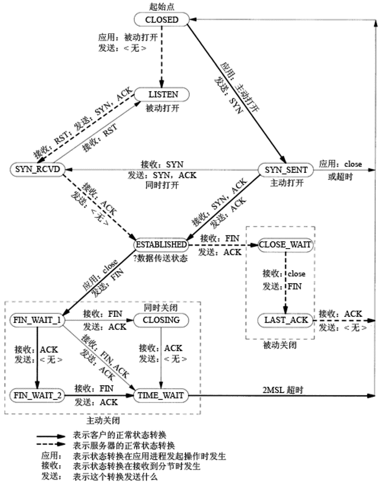

`Java后台开发`一般要求的知识是掌握一些开发技能，一般是从`SSH`框架，问问项目，有些注重基础能力的，就会往`Java SE`方面问，例如`HashMap`，`Object`类有几个方法，虚拟机，垃圾回收机制等。大公司会考察分布式应用知识作为加分项，如`Hadoop`、`MapReduced`等。

笔者当年对`C++后台开发`有错误的认知，认为与Java的要求大约一致，仅仅要求开发技能，也没有到网上搜索攻略，到了真正跑招聘的时候才发现这个岗位除了一般`C++`知识基础外，还要求有`Linux`系统操作知识(常用命令在内)、`TCP/IP`通信基础、`Socket`开发经验等。其中`TCP`的要求如下图:



但是这个图背诵起来也不容易，总结一下主要考察的是`3次握手`、`4次挥手`。

三次握手的流程:
``` text
1.server先初始化好了一个监听用的socket，server进入了LISTEN状态;
2.客户端发起了TCP连接，向server发送了一个SYN，进入SYN_SENT状态;
3.server接收到了来自客户端的SYN，向发起请求的客户端发送SYN+ACK，进入SYN_RCVD状态;
4.客户端接收到了server返回的SYN+ACK信号，发送ACK信号给server，进入ESTABLISHED状态;
5.server接收到了ACK，进入ESTABLISHED状态。
```
整个三次握手的文本描述过程就是这样。

四次握手的客户端状态转换则有点麻烦，主要与server返回FIN和ACK的顺序有关。

（待续）