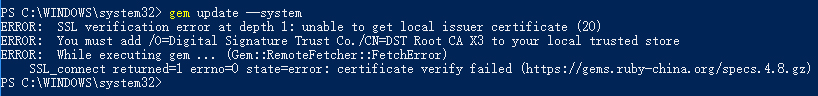
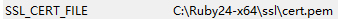
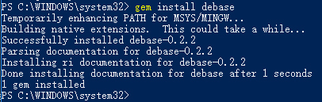

### 问题现象

最近在`Win 10`电脑上装了`Ruby`的环境，因为在`VS Code`有关的插件要用一些依赖，在`gem`执行安装命令的时候总报错误：



### 不推荐的解决方案

经过搜索求助，发现并没有有效的解决方法，根据`Ruby China`的[解决方法](https://gems.ruby-china.org/)，实在不行可以将`~/.gemrc`中的设置改为：

``` text
:sources:
- http://gems.ruby-china.org
:ssl_verify_mode: 0
```

注意要将`https`换为`http`，设置`:ssl_verify_mode: 0`关闭`SSL`功能。

但是这样就没有了安全性了，对安全有要求的看官估计也不太接受这个解决方案。

### 原因发现及解决方案

<font color="red">若是曾经安装过Ruby的用户，那么该解决方案应该很有参考价值。</font>

`Ruby China`上也说了，如果配置正确的话是不会发生`SSL`错误的，加上笔者最终在网上搜索到一个[近似的案例以及解决方案](https://superdevresources.com/ssl-error-ruby-gems-windows/)。

最终在电脑的环境设置中找到了`SSL_CERT_FILE`选项：


笔者猜测是装旧版本时安装器就设置了这个环境变量，而卸载时这个变量并未随之被取消，新版本安装器探测到了已经设置该变量就不再检测并更正了，导致了笔者后面几次安装`Ruby`之后都无法正常使用`gem`。

安装的`Ruby 2.4.1`里面`SSL证书`的路径为：

``` text
C:\Ruby24-x64\ssl\cert.pem
```

基本上就可以确认是变量的不正确设置引起的，更正变量为：



启动命令行并执行一些`gem`命令：



命令正常运行，问题解决。