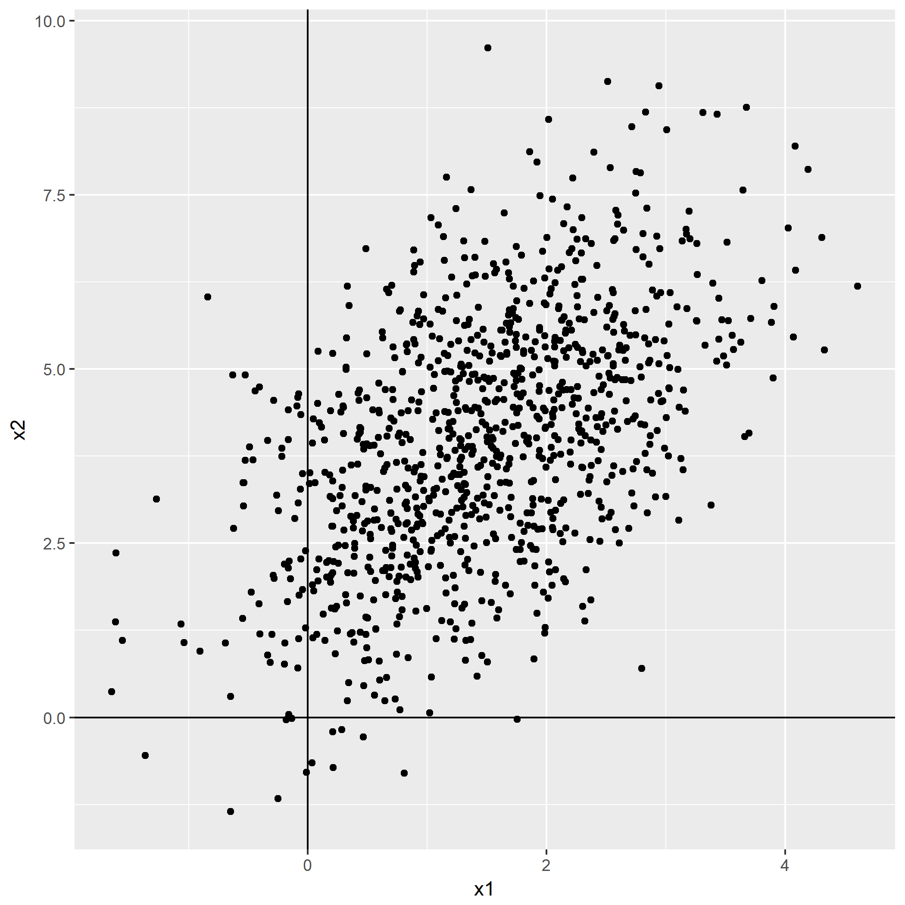
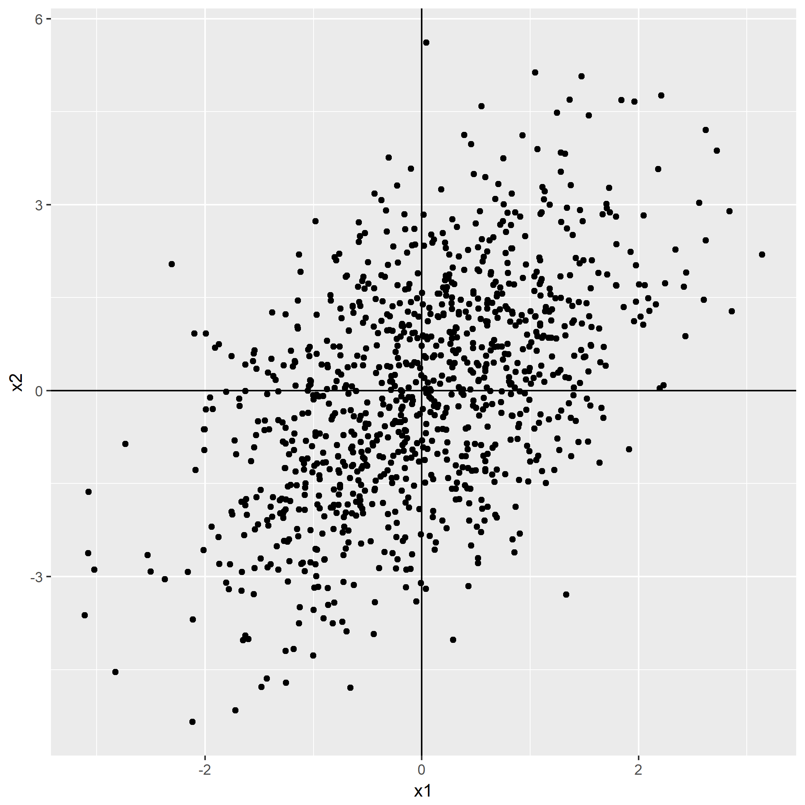
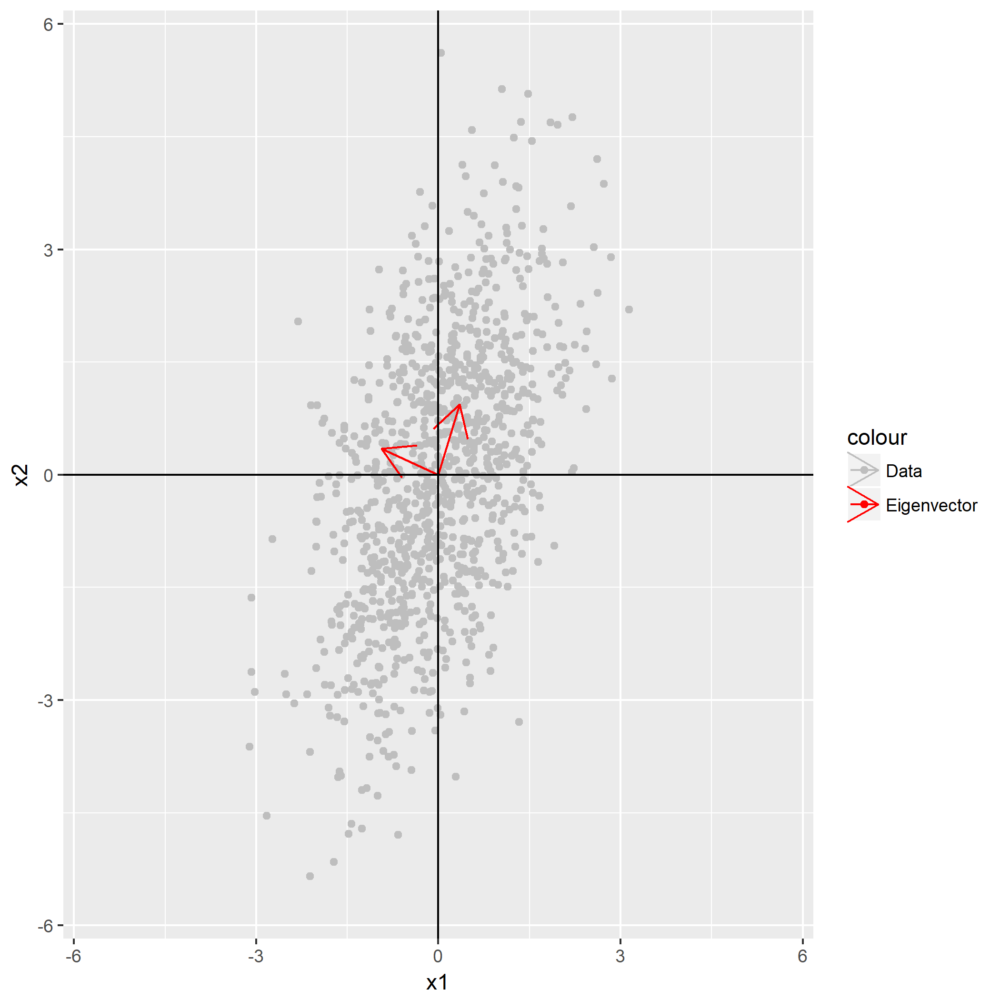
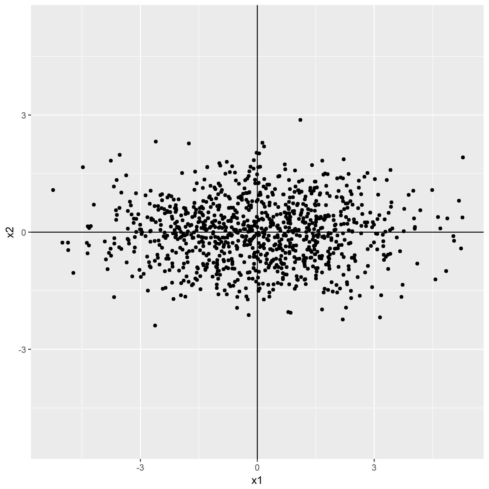
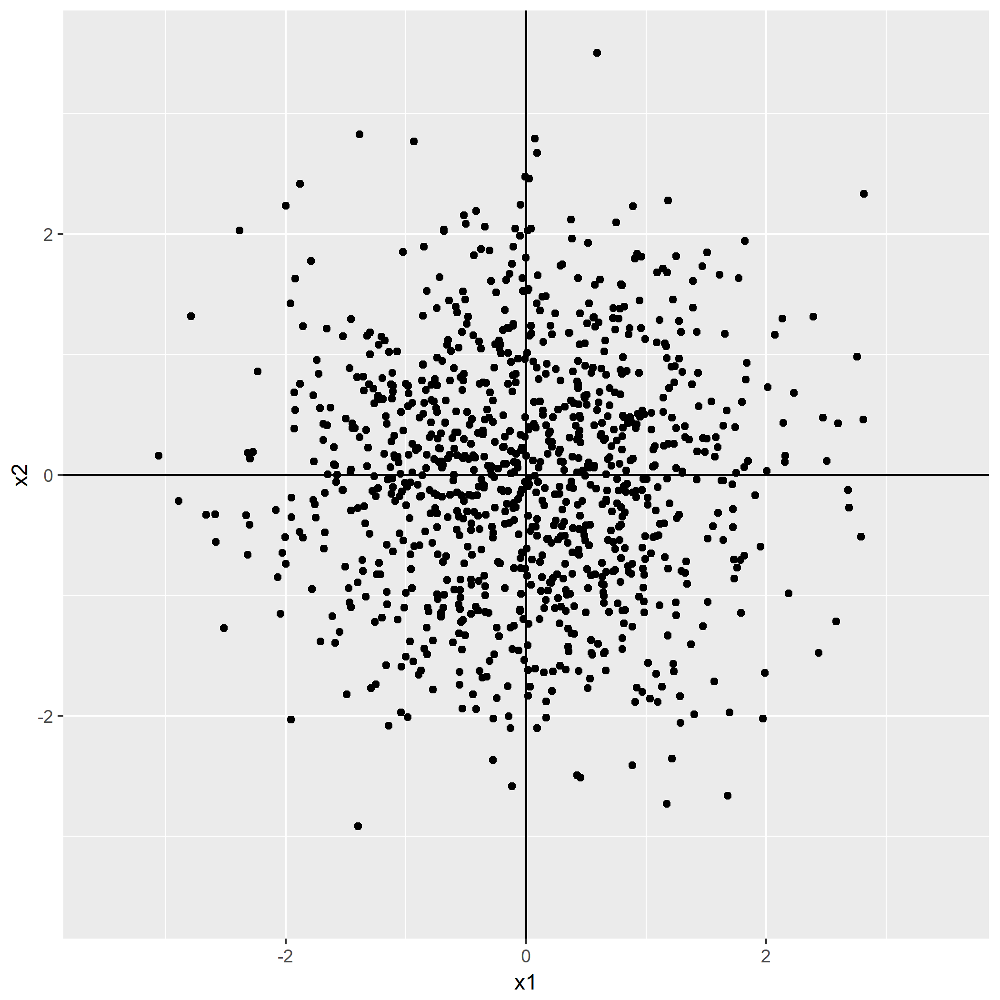

白化，Whitening，有些文献也将该过程称作`Sphering`。

白化的目的是：

- 特征之间相关性较低
- 所有特征具有相同的方差

白化处理分PCA白化和ZCA白化，PCA白化保证数据各维度的方差为1，而ZCA白化保证数据各维度的方差相同。

PCA白化可以用于降维也可以去相关性，而[ZCA白化](http://ufldl.stanford.edu/wiki/index.php/%E7%99%BD%E5%8C%96)主要用于去相关性，且尽量使白化后的数据接近原始输入数据。

该部分仅仅介绍ZCA白化。

首先展示原始的输入$x=(x_1, x_2)$：

第一步作中心化，使得每个维度的均值为$0$，即$\tilde{x}=(x_1 - \bar{x}_1, x_2 - \bar{x}_2)$：

接下来求数据的协方差矩阵，根据协方差公式$cov(X, Y) = E[(X-E(X))(Y-E(Y))]$，有：

$$
cov(\tilde{x}_1, \tilde{x}_2) = E[(x_1 - \bar{x}_1)(x_2 - \bar{x}_2)] = E[\tilde{x}_1 \tilde{x}_2]
$$

对求得的协方差矩阵，对于2维的输入，将所得的特征向量与中心化后的数据一同显示：

去相关过程，记住“实对称矩阵的特征向量矩阵是正交矩阵”，设特征向量组成的矩阵为$Q$，接下来就是将数据到特征向量，$\hat{x}=Q\tilde{x}^T$：

最后作缩放，设协方差矩阵作特征分解后的特征值矩阵为：

$$
\Lambda=\left[\begin{matrix} \lambda_1 &  \\ & \lambda_2 \end{matrix}\right]
$$

缩放$x_{zca} = \Lambda^{-\frac{1}{2}} \hat{x}_T = (\frac{\hat{x}_1}{\sqrt{\lambda_1}}, \frac{\hat{x}_2}{\sqrt{\lambda_2}})^T$：

数据的分布就变圆了一些，这也是为什么白化过程也成为`Sphering`的原因。