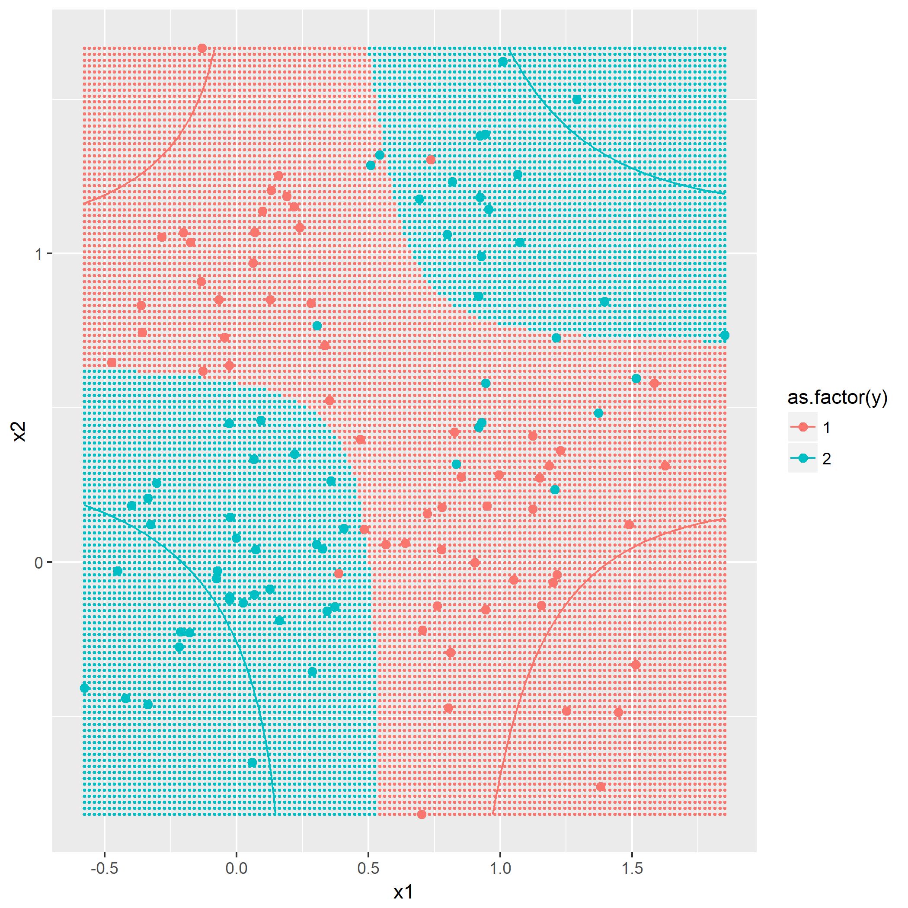
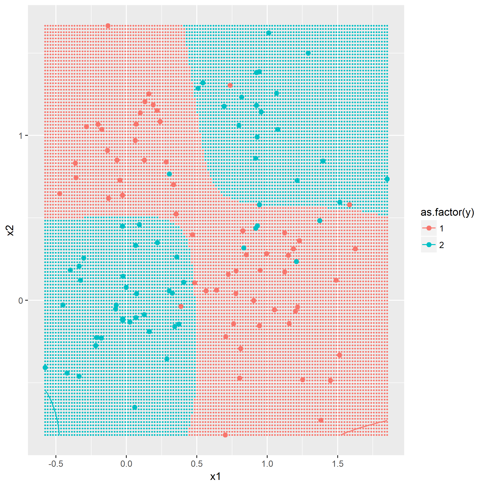
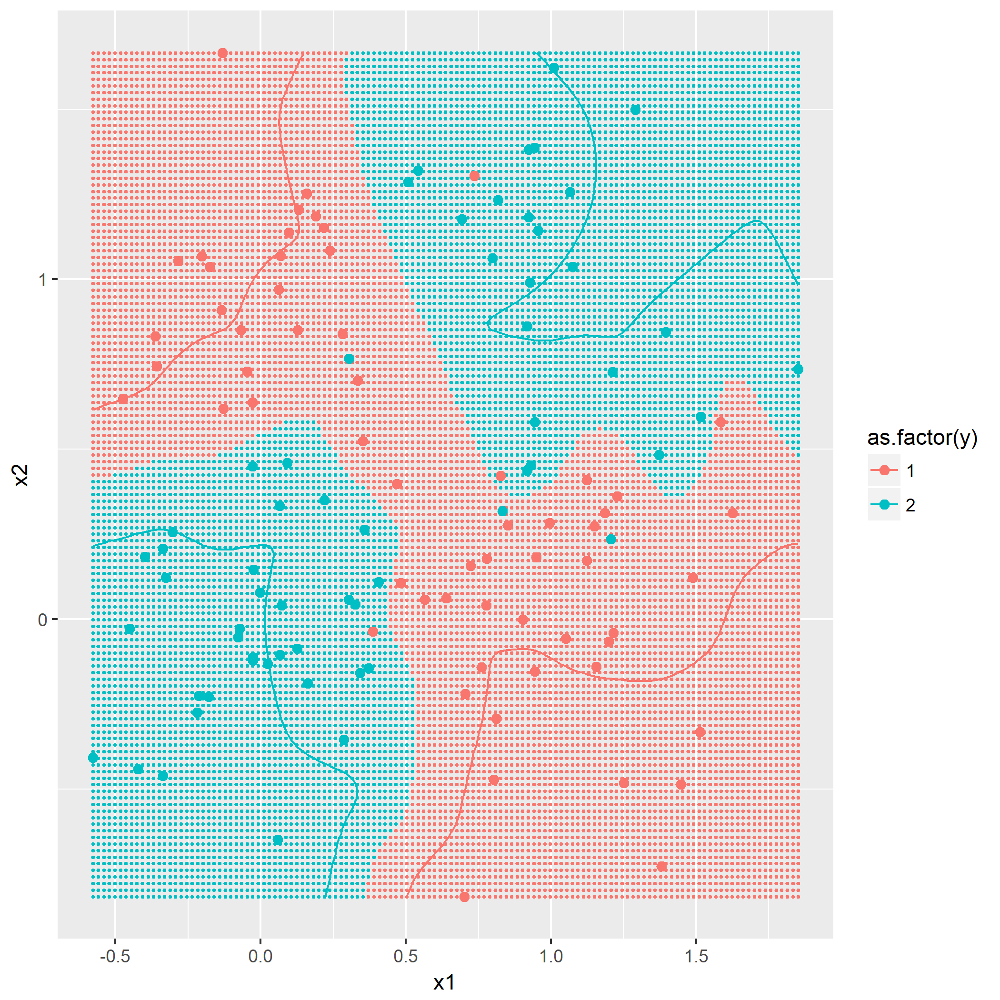
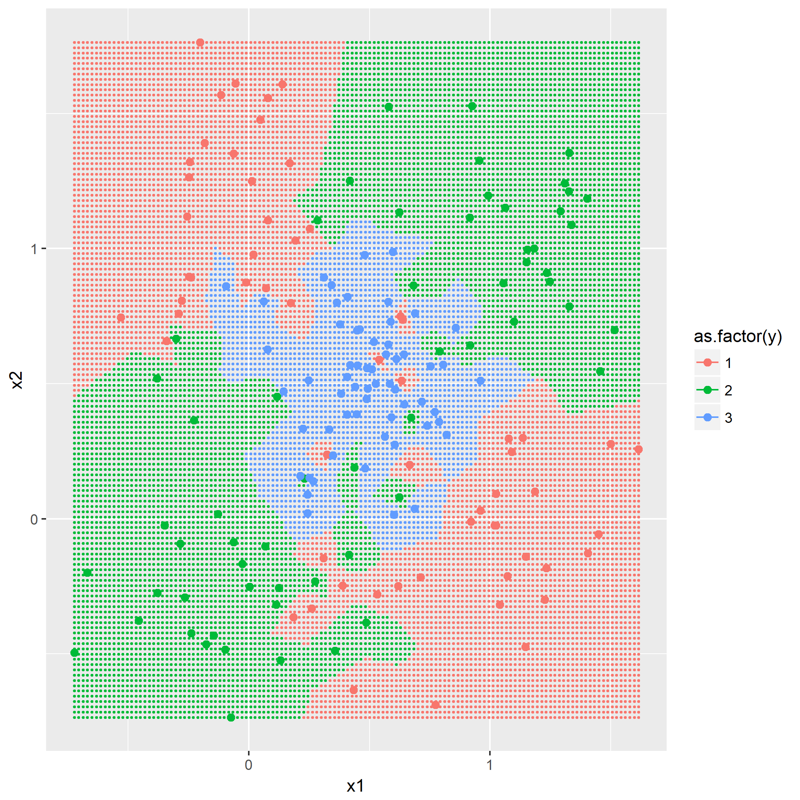
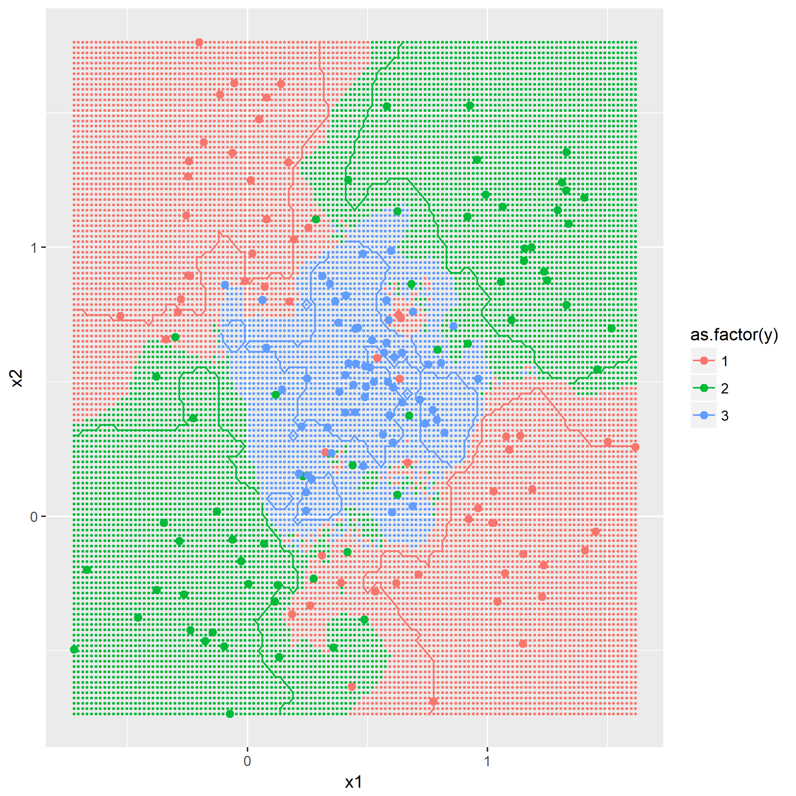
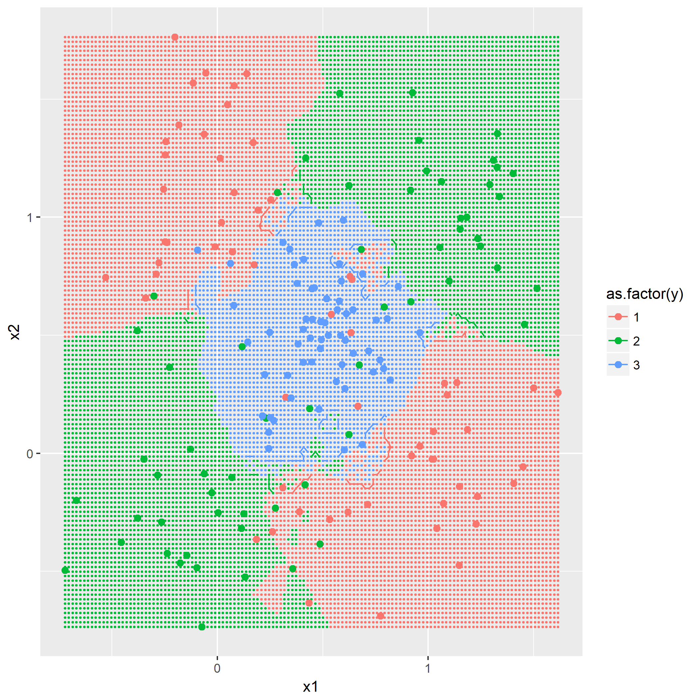
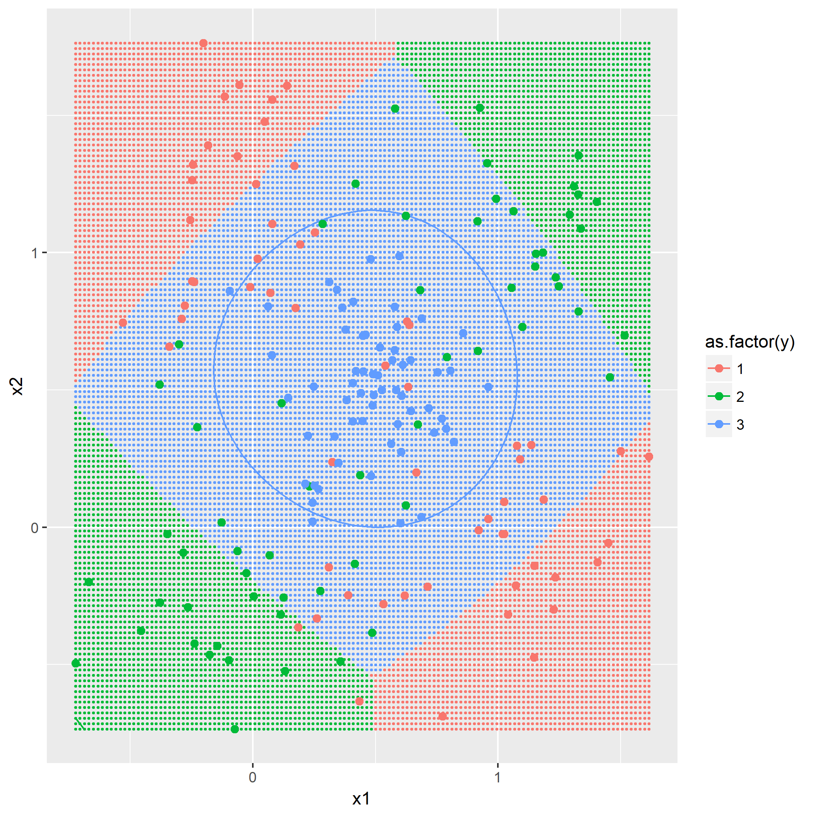
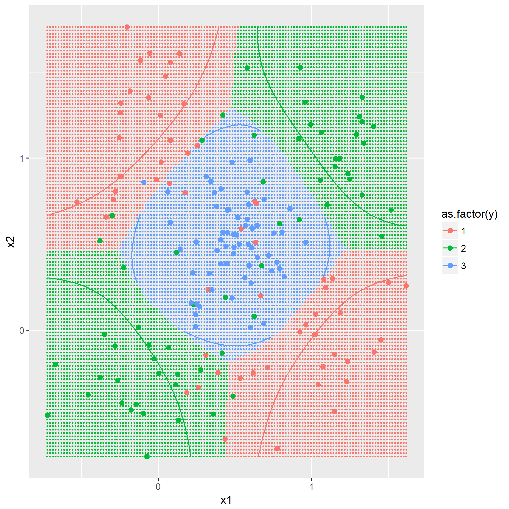
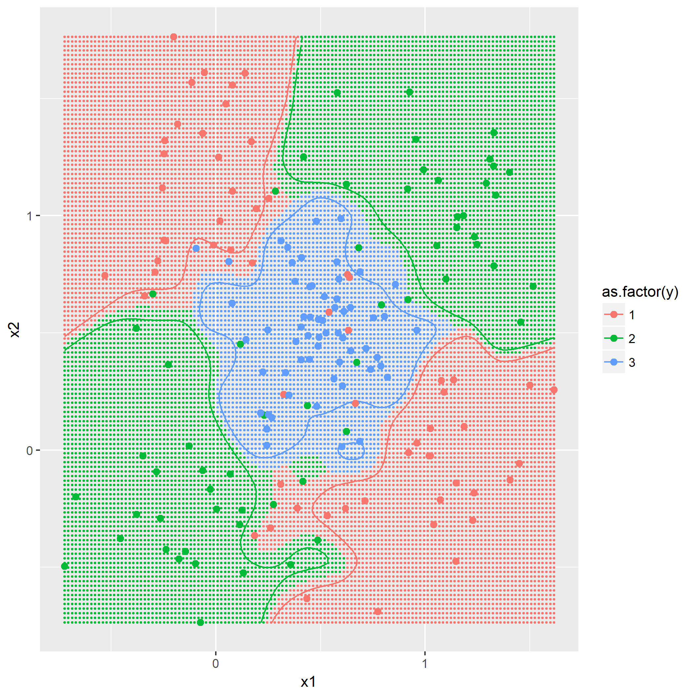

### 题目7.1 - 训练数据的准备

目的是产生一个典型的`XOR`问题的数据分布，通过如下的公式产生：

$$
\begin{align}
p(X|y=0)=\frac{1}{2}[\mathcal{N}(X|\mu_1,\sigma^2)+\mathcal{N}(X|\mu_2,\sigma^2)] \\
p(X|y=1)=\frac{1}{2}[\mathcal{N}(X|\mu_3,\sigma^2)+\mathcal{N}(X|\mu_4,\sigma^2)]
\end{align}
$$

其中$\mu_1=(0,1)^T,\mu_2=(1,0)^T,\mu_3=(0,0)^T,\mu_4=(1,1)^T,\sigma^2=0.1$。

根据规则产生`y=0`以及`y=1`各60组的数据分布：

### 题目7.2 - k近邻

[kNN](https://en.wikipedia.org/wiki/K-nearest_neighbors_algorithm)算法概念，令`k=1,3,5`，描绘出决策边界，没有什么技巧，就是暴力计算，用密集的点表示出决策边界：

### 题目7.3 - "Parzen window"分类器

基于欧氏范数的高斯窗口函数：

$$
\mathcal{k}(x,x^{(\alpha)} = exp(-\frac{1}{2\sigma_{\mathcal{k}}^2}||x-x^{(\alpha)}||^2)
$$

即根据作为训练集的点与将被预测的点的距离通过此函数计算出影响权重，最后得出哪个类别的权重最大。

利用同样作图方法，画出$\sigma_{\mathcal{k}}^2=0.5,0.1,0.01$时的决策边界。

可以看到$\sigma_{\mathcal{k}}^2$值越小，边界越靠近支持向量机的结果。

第二问是添加第三个类别，根据$\mu_3=(0.5,0.5)^T,\sigma=0.05$，然后利用kNN和Parzen窗口同样的参数再跑一遍算法，观察结果。

### 题目7.4 - RBF网络

上一题里面，利用全体训练集对进来的点进行预测，显然是一个自然而然的选择，但是当训练集的样本数很大时，假设进来t个点，那么判定的时间复杂度就攀升到$\Theta(t*N)$，显然对计算能力提出了要求。那么一个想法就是，能不能通过采集一些训练集中具有代表性的点，用来进行预测？

（未完待续）