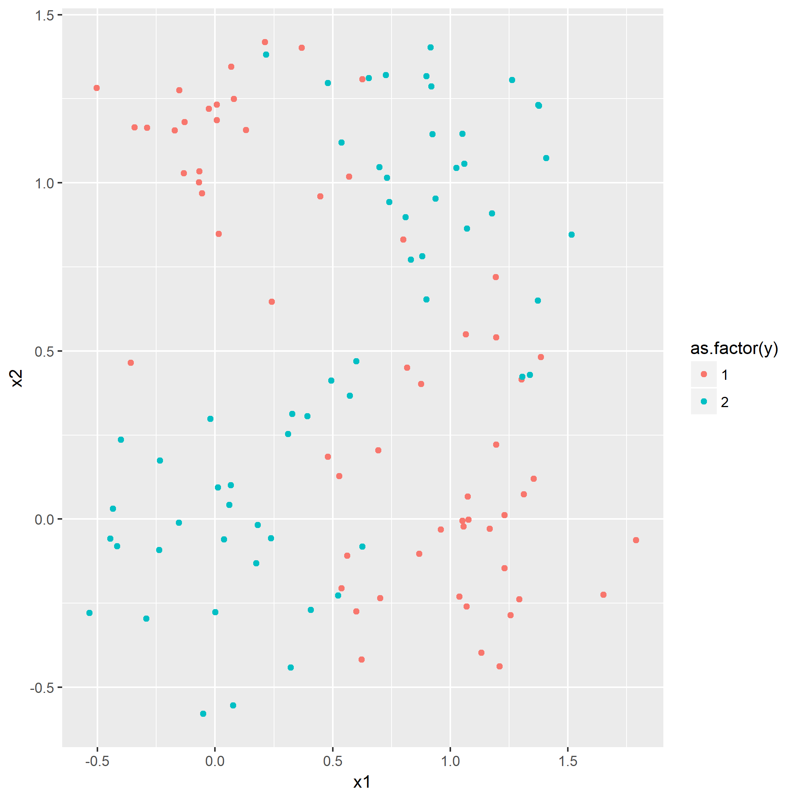
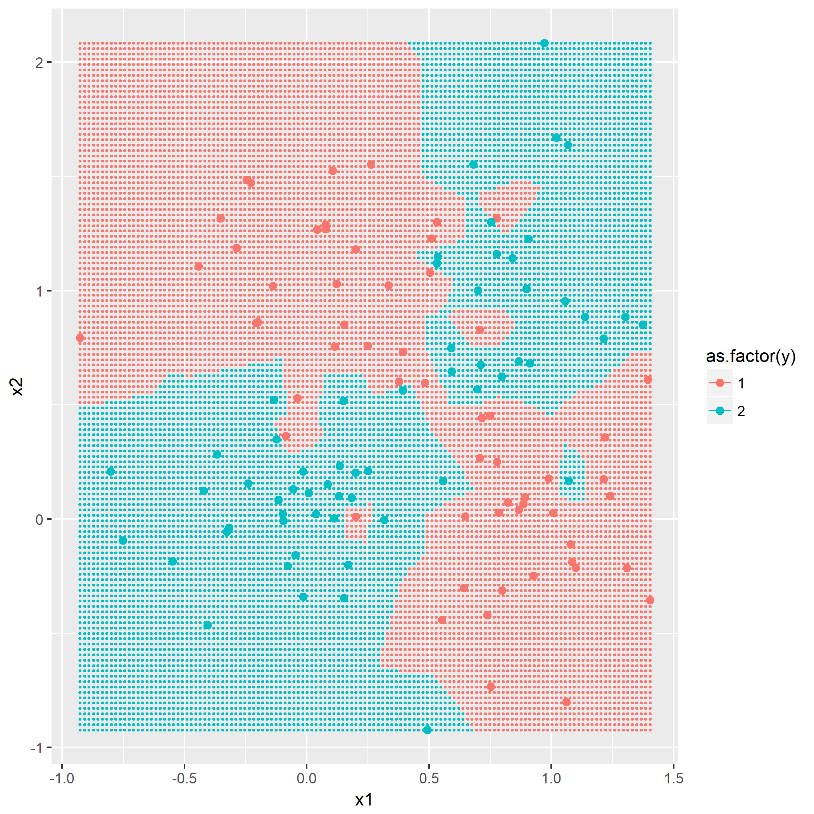
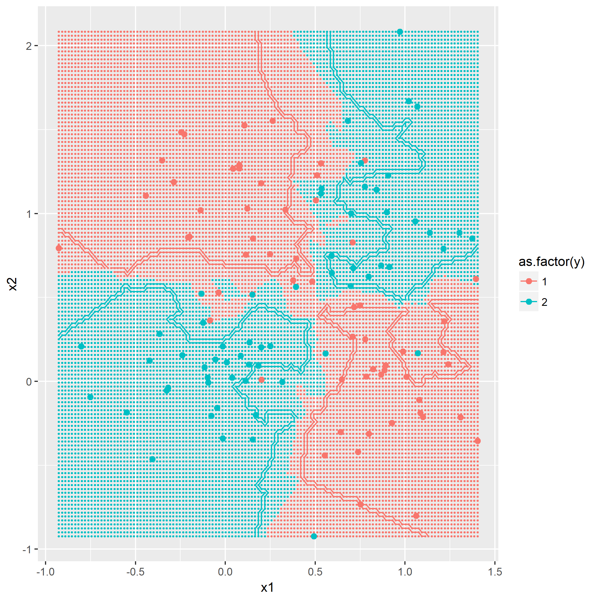
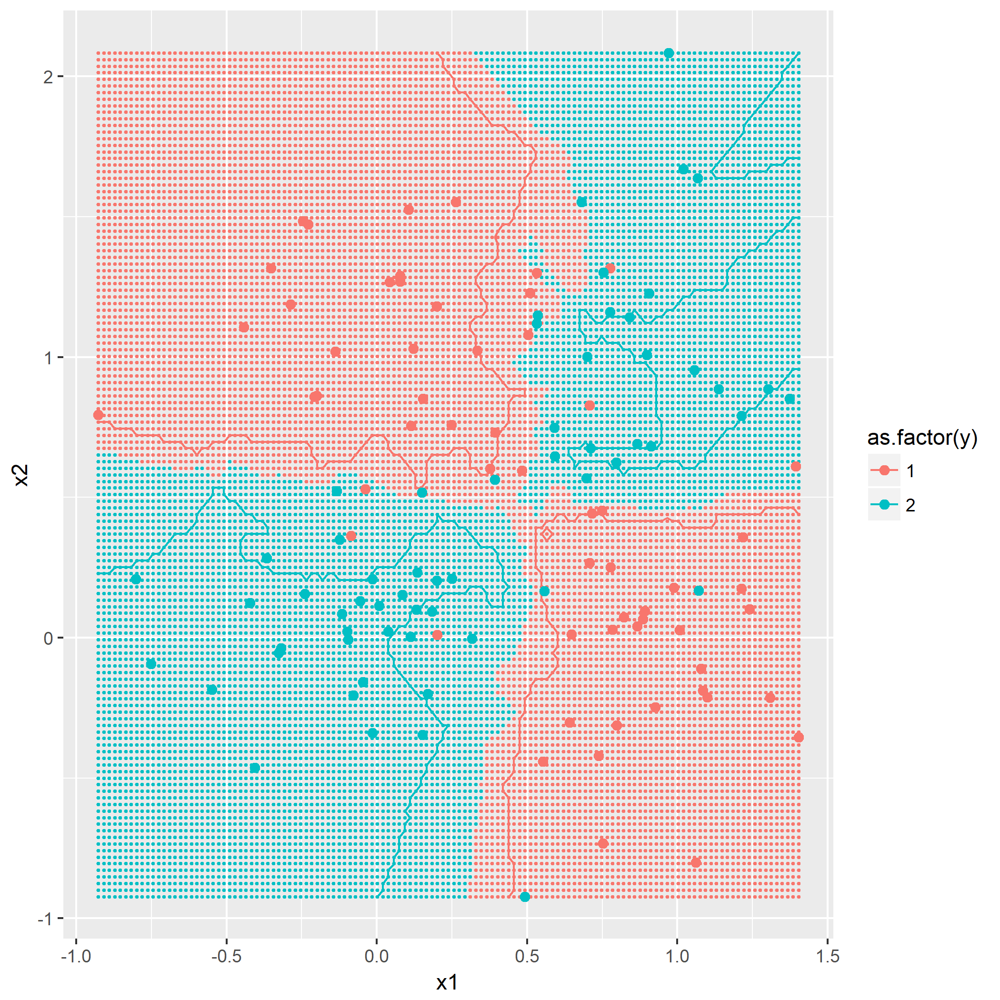

### 题目7.1 - 训练数据的准备

目的是产生一个典型的`XOR`问题的数据分布，通过如下的公式产生：

$$
\begin{align}
p(X|y=0)=\frac{1}{2}[\mathcal{N}(X|\mu_1,\sigma^2)+\mathcal{N}(X|\mu_2,\sigma^2)] \\
p(X|y=1)=\frac{1}{2}[\mathcal{N}(X|\mu_3,\sigma^2)+\mathcal{N}(X|\mu_4,\sigma^2)]
\end{align}
$$

其中$\mu_1=(0,1)^T,\mu_2=(1,0)^T,\mu_3=(0,0)^T,\mu_4=(1,1)^T,\sigma^2=0.1$。

根据规则产生`y=0`以及`y=1`各60组的数据分布：

### 题目7.2 - k近邻

[kNN](https://en.wikipedia.org/wiki/K-nearest_neighbors_algorithm)算法概念，令`k=1,3,5`，描绘出决策边界，没有什么技巧，就是暴力计算，用密集的点表示出决策边界：

### 题目7.3 - "Parzen window"分类器

（未完待续）