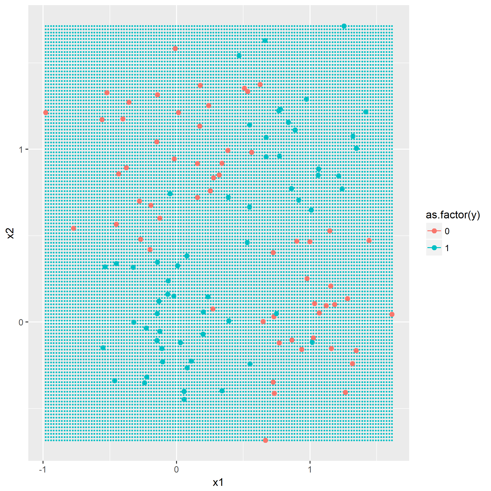
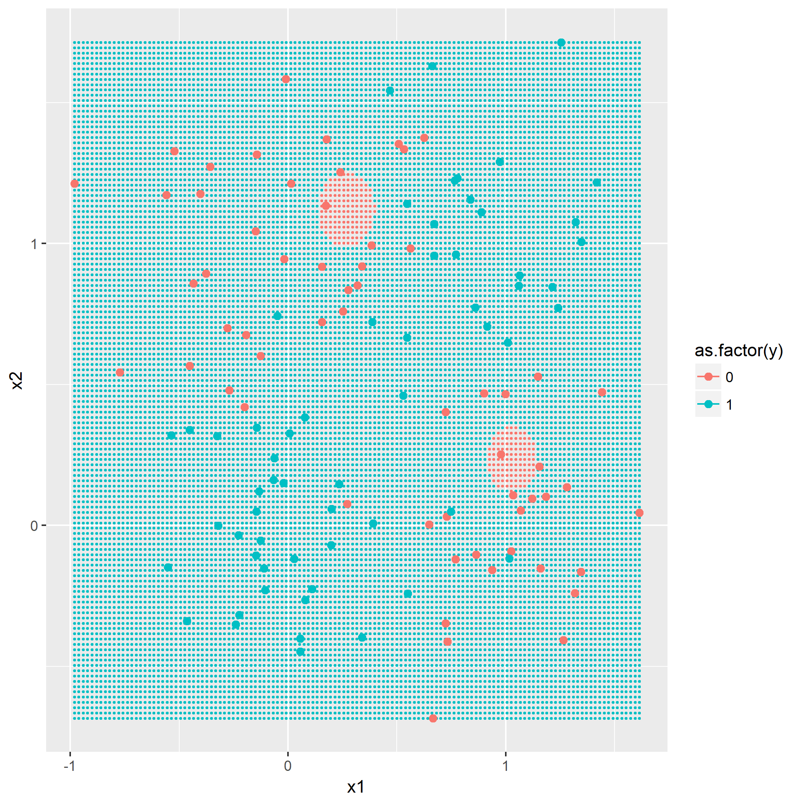
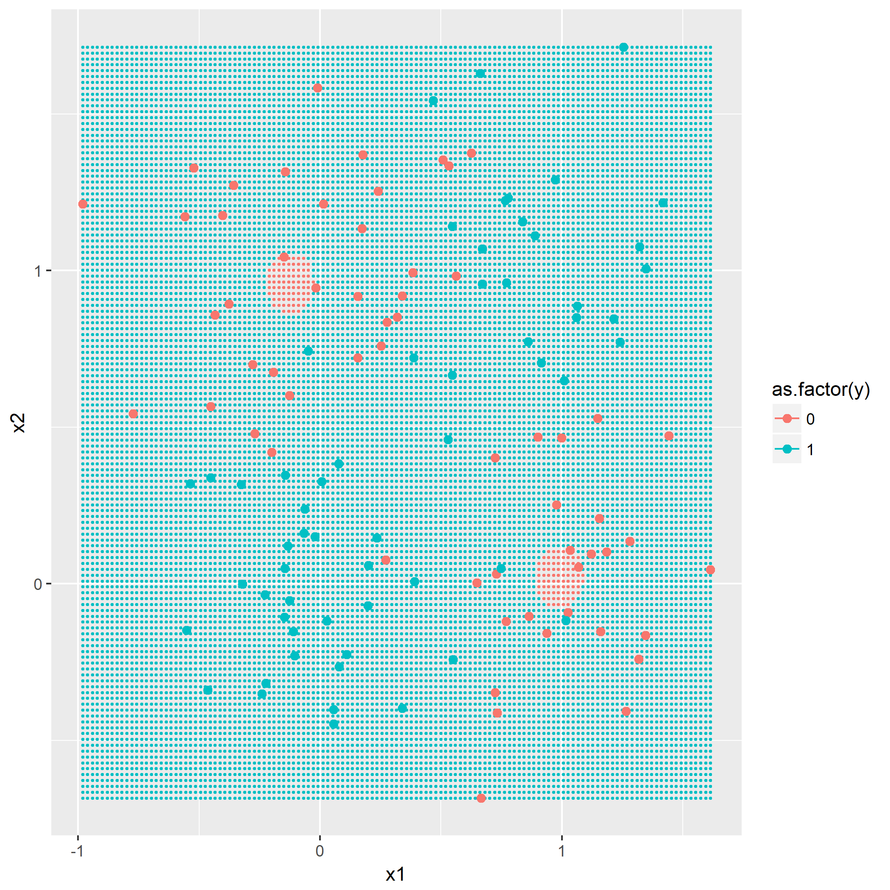
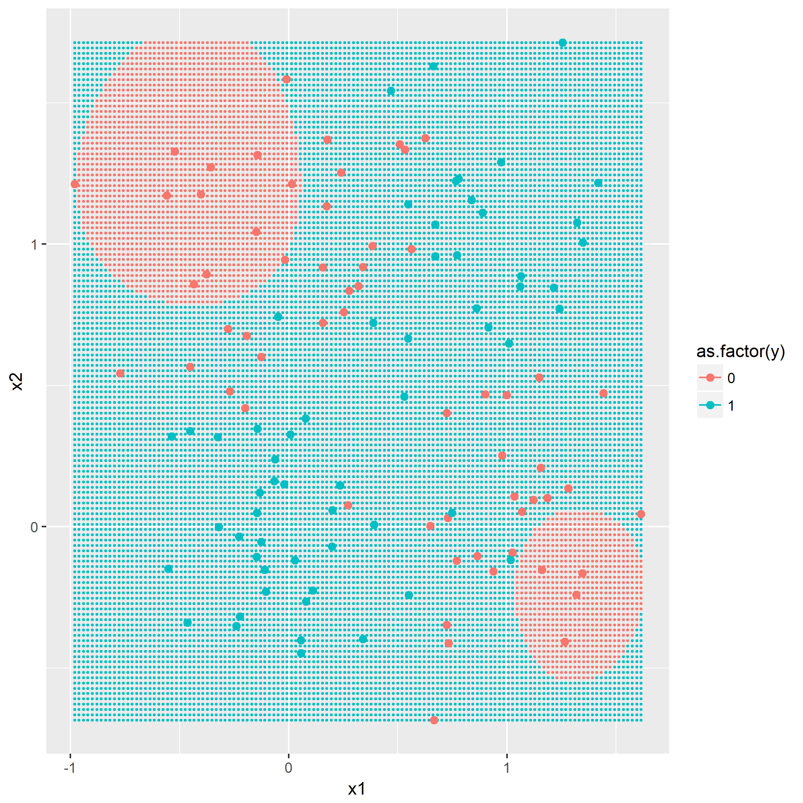
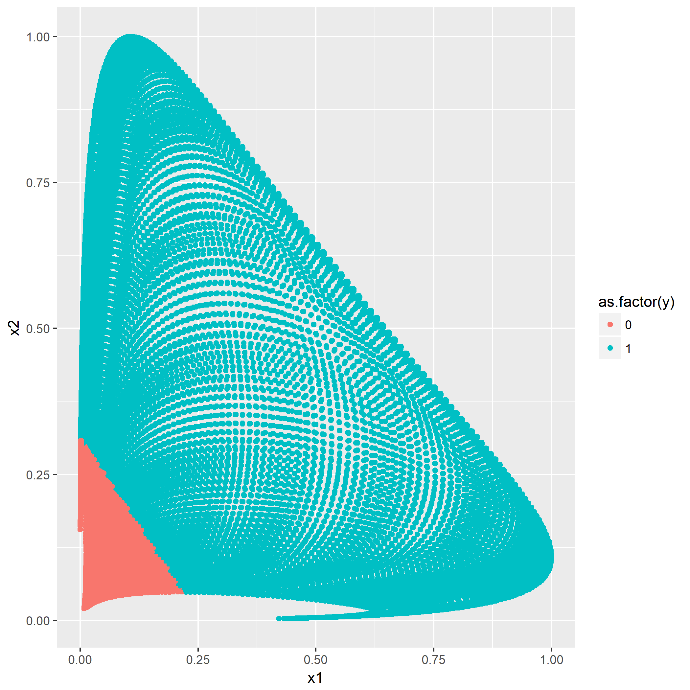

### 题目7.1 - 训练数据的准备

目的是产生一个典型的`XOR`问题的数据分布，通过如下的公式产生：

$$
\begin{align}
p(X|y=0)=\frac{1}{2}[\mathcal{N}(X|\mu_1,\sigma^2)+\mathcal{N}(X|\mu_2,\sigma^2)] \\
p(X|y=1)=\frac{1}{2}[\mathcal{N}(X|\mu_3,\sigma^2)+\mathcal{N}(X|\mu_4,\sigma^2)]
\end{align}
$$

其中$\mu_1=(0,1)^T,\mu_2=(1,0)^T,\mu_3=(0,0)^T,\mu_4=(1,1)^T,\sigma^2=0.1$。

根据规则产生`y=0`以及`y=1`各60组的数据分布：

### 题目7.2 - k近邻

[kNN](https://en.wikipedia.org/wiki/K-nearest_neighbors_algorithm)算法概念，令`k=1,3,5`，描绘出决策边界，没有什么技巧，就是暴力计算，用密集的点表示出决策边界：

### 题目7.3 - "Parzen window"分类器

基于欧氏范数的高斯窗口函数：

$$
\mathcal{k}(x,x^{(\alpha)} = exp(-\frac{1}{2\sigma_{\mathcal{k}}^2}||x-x^{(\alpha)}||^2)
$$

即根据作为训练集的点与将被预测的点的距离通过此函数计算出影响权重，最后得出哪个类别的权重最大。

利用同样作图方法，画出$\sigma_{\mathcal{k}}^2=0.5,0.1,0.01$时的决策边界。

可以看到$\sigma_{\mathcal{k}}^2$值越小，边界越靠近支持向量机的结果。

第二问是添加第三个类别，根据$\mu_3=(0.5,0.5)^T,\sigma=0.05$，然后利用kNN和Parzen窗口同样的参数再跑一遍算法，观察结果。

### 题目7.4 - RBF网络

上一题里面，利用全体训练集对进来的点进行预测，显然是一个自然而然的选择，但是当训练集的样本数很大时，假设进来t个点，那么判定的时间复杂度就攀升到$\Theta(t*N)$，显然对计算能力提出了要求。那么一个想法就是，能不能通过采集一些训练集中具有代表性的点，用来进行预测？

通过这样的思路，选区代表性的点可以通过`K-means`方法，然后对于每个将要进行预测的点，计算该点与这些代表点的距离（高斯窗口函数），将所得的“距离”作为线性分类器的输，即利用下述的表达式：

$$
y(x)=sign(w^T \phi(x))
$$

其中：

$$
\phi(x)=\left(
\begin{matrix}
1 \\
\phi_1(x) \\
\phi_2(x) \\
... \\
\phi_K(x)
\end{matrix}
\right), w\in \mathbb{R}^{K+1}
$$

$\phi_i(x)=\mathcal{k}(x, t_i)$，$t_i$为代表点，信号函数：

$$
sign(h)=
\begin{cases}
1, & h \gt 0 \\
0, & else
\end{cases}
$$

根据最小二乘法，可知训练后的权重：

$$
w=(\Phi\Phi^T)^{-1}\Phi y^T, \Phi = \left(\phi(x^{(1)}),...,\phi(x^{(N)})\right) \in \mathbb{R}^{K+1,N}
$$

第一问就令$K=2,3,4$，选取合理的$\sigma^2_k$，笔者选择0.5与0.01，画出决策边界：

回想一下一个`XOR`点的分布图，$K$为4的倍数时应该是最佳的效果。

第二问通过修改固定的两个代表点$t_1=(0,0)^T,t_2=(1,1)^T$来检验效果，其中$\sigma^2_k=0.45$，笔者就不画出决策边界了，但是经过线性处理之后的图像，笔者认为可以看一看：

其中横坐标轴为$\phi_1(x)$，纵座标轴为$\phi_2(x)$，显然通过核函数转换之后，问题变成了线性可分。

至此第七章的练习结束。