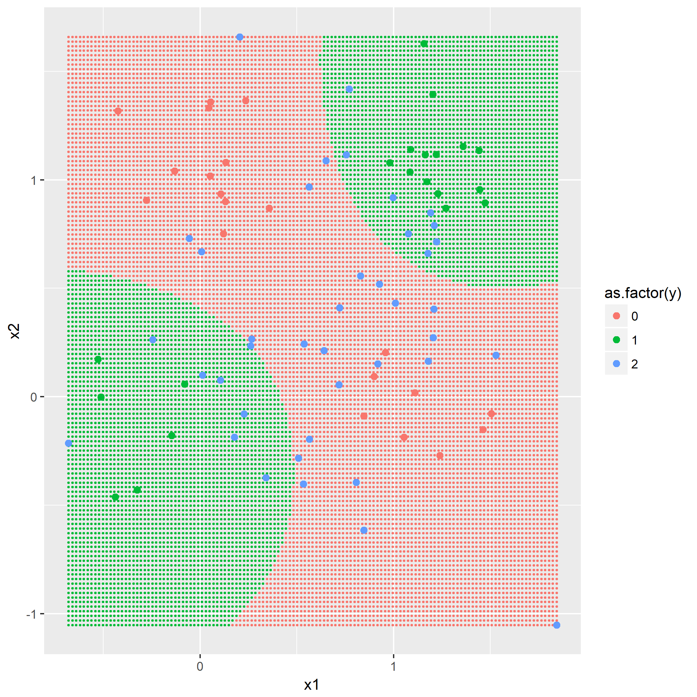

C-SVM：Cost-sensitive SVM，代价敏感SVM。

### 题目9.1 - C-SVM优化问题求解

线性神经元中存在一个未用在分类中的自由度。通过设置如下约束消除：

$$
\underset{\alpha=1,...,p}{\min}\left|w_T x^{(\alpha)} + b\right|\overset{!}{=}1
$$

证明在此约束下，样本$x^{(\alpha)}$到决策边界${x|y(x)=0}$上最近的一点被下式限制：

$$
d(x^{(\alpha)},w,b)\geq \frac{1}{||w||}, \forall \alpha \in {1,...,p}.
$$

第二问，是写下C-SVM的拉格朗日的优化问题并解出C-SVM的对偶优化问题：

$$
\underset{\lambda}{\max}\left\{-\frac{1}{2}\sum_{\alpha=1}^{p}\sum_{\beta=1}{p}\lambda_\alpha \lambda_\beta y_T^{(\alpha)} y_T^{(\beta)} \left(x^{(\alpha)})\right)^T x^{(\beta)} + \sum_{\alpha=1}^{p}\lambda_\alpha \right\}
$$

其中：

$$
0\leq \lambda_\alpha \leq \frac{C}{p},\forall \alpha, \sum_{\alpha=1}^{p}\lambda_\alpha y_T^{(\alpha)}=0.
$$

关于SVM优化的证明过程及解释网上都有不少优秀的讲解，笔者在此就不展开了。

### 题目9.2 - 标准参数下的C-SVM

本题目是练习解决经典的“XOR”分类问题。首先通过前面章节题目7.1产生80个样本的训练集，然后通过同样的分布产生80个样本的测试集。这里不实现SVM算法，对于`matlab`，可以使用`libsvm`包；对于`python`则可以使用`libsvm`与`scikit.learn`；笔者使用的`R`中的`e1071`。

通过软件自身默认的C-SVM训练参数建立模型，并用将模型应用在测试集上。把决策边界显示出来，同时表示出支持向量。

### 题目9.3 - C-SVM参数优化

使用交叉验证以及网格搜索发找出C与核参数$\gamma$。使用指数增长搜索，如$$C\in \{ 2^{-6},2^{-4},...,2^{10} \},\gamma\in \{ 2^{-5},2^{-3},...,2^{9} \}$$，画出交叉验证中训练集分类率，以及使用等高线画出参数空间下的关于这两个参数的值。

第二问使用上述所得的最佳$C,\gamma$，重做练习9.2。

（未完待续）