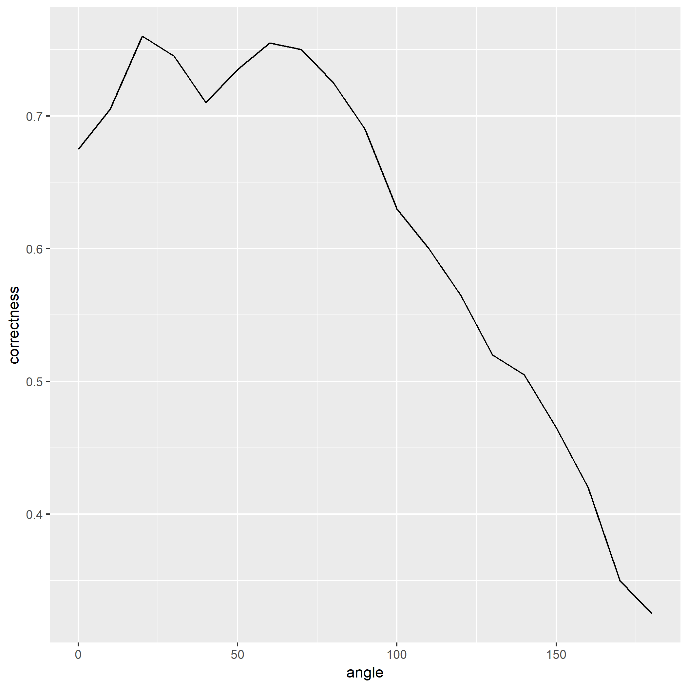
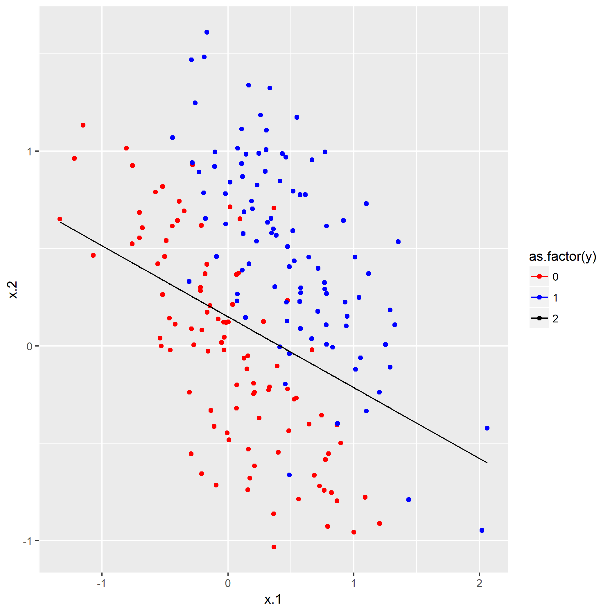

### 题目2.1 - 连结主义神经元

该练习用到的数据集[Apples Oranges](https://raw.githubusercontent.com/CFWLoader/supreme-bassoon/master/MachineIntelligence/datasets/applesOranges.csv)，数据存储两个分类，有200组数据，有两列属性以及一列分类。用简单的神经元对样本进行分类，每个样本$x\in \mathbb{R}^2$，其中预测结果$\hat{y}$：

$$
\hat{y} = sgn(w^T x - \theta)
$$

第一题是画散点图，因为只有`x.1`和`x.2`两个属性，并且只是一个二分类问题，笔者用`R`画出散点图（[源码](https://github.com/CFWLoader/supreme-bassoon/blob/master/MachineIntelligence/e2/e2-1a.R)）:


可以看到，还是比较容易分类的。

然后第二题就是设置10°为间隔以及$\theta = 0$，让$\alpha\in [0°, 180°]$开始设置$\vec{w}$的两个权值$(w_1\in [-1,1], w_2\in [0, 1])$，输出这些$\alpha$对应的分类正确率，并画图。

因为刚好只有两个属性，$\alpha$在二维直角坐标系中，刚好有：

$$
\begin{align}
w_1 = cos\alpha \\
w_2 = sin\alpha
\end{align}
$$

将每个$\vec{w}$应用到属性集上得出$\hat{y}$，与原本的标签$y_0$对比得出正确率，最后得到`正确率-角度`的图（[源码](https://github.com/CFWLoader/supreme-bassoon/blob/master/MachineIntelligence/e2/e2-1b.R)）：


## <font color="red">注意</font>

笔者在第二问就尝试输出$\theta = 0$时最佳的$\alpha=20°$的图像，发现直线并不是所期待一般近似划分两个类：


在开始探究原因之前，先回想清楚的定义。

定义是没有问题的，那是因为刚好$\theta = 0$导致直线方程$w_1 x_1 + w_2 x_2 = 0$，即所得的直线刚好是法向量所在的直线，于是划分类的超平面恰好垂直于该直线，根据两直线垂直其斜率之积为$-1$可以得到最终划分超平面的超平面方程为$x_2 = \frac{w2}{w1} x_1$，根据方程作出直线：


这样才有点像划分的样子，但是要注意这仅仅是$\theta = 0$时的特例，一般情况所得$w^T x + \theta = 0$超平面便是划分点集的超平面。

接下来一问是根据上一问得出的最佳的$\vec{w}$，组合$\theta\in [-3,3]$，得出正确率最高的$\theta$（[源码](https://github.com/CFWLoader/supreme-bassoon/blob/master/MachineIntelligence/e2/e2-1c.R)）：

运行得到：

$$
\theta = -0.15
$$

接下来是根据前两问得出来的$\vec{w}$和$\theta$画图（[源码](https://github.com/CFWLoader/supreme-bassoon/blob/master/MachineIntelligence/e2/e2-1d.R)）：



然后就是尝试$\alpha\in [0°, 180°], \theta\in[-3,3]$不同的组合，并画出[热度图](https://en.wikipedia.org/wiki/Heat_map)。

运行[代码](https://github.com/CFWLoader/supreme-bassoon/blob/master/MachineIntelligence/e2/e2-1e.R)画图：


可以肉眼看出正确率较高时的组合在哪个部分。

笔者额外求得最高正确率时的$\alpha$与$\theta$：

``` text
angle theta        w1        w2 correctness
   40  0.35 0.6427876 0.7660444       0.915
```

并作图：


根据方程$w_1 x_1 + w_2 x_2 + \theta = 0$所转化成的$ x_2 = -(w_1 x_1 + \theta) / w_2$是没问题的，但是肉眼判断这个决策面明显达不到$90\%$以上的正确率。

原因是在笔者画线是所用的方程$ y = -(w_1 x_1 + \theta) / w_2$，注意仅仅用了$x_1$来生成直线，该超平面应该经过$(x_1, x_2)$相关的点，于是便造成这样的错误，笔者并未打算在此解决这个错误，因为在以后学习[LDA](https://en.wikipedia.org/wiki/Linear_discriminant_analysis)、[SVM](https://en.wikipedia.org/wiki/Support_vector_machine)、[PCA](https://en.wikipedia.org/wiki/Principal_component_analysis)等问题时会解决这个问题。

### 题目2.2 - 多层感知机