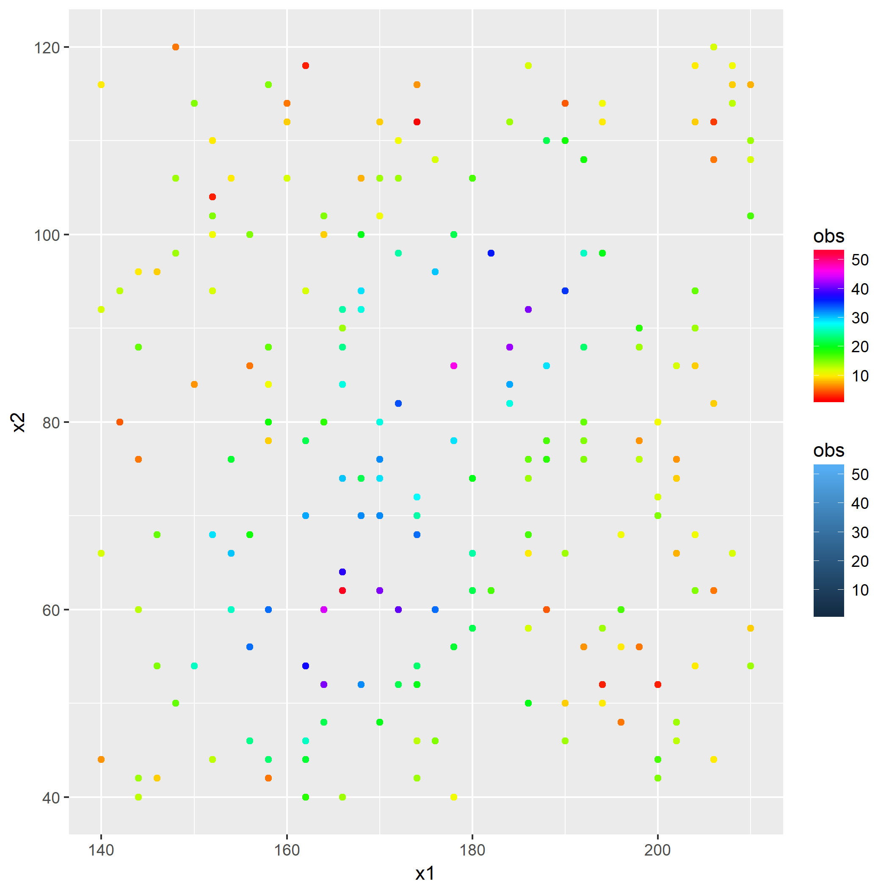
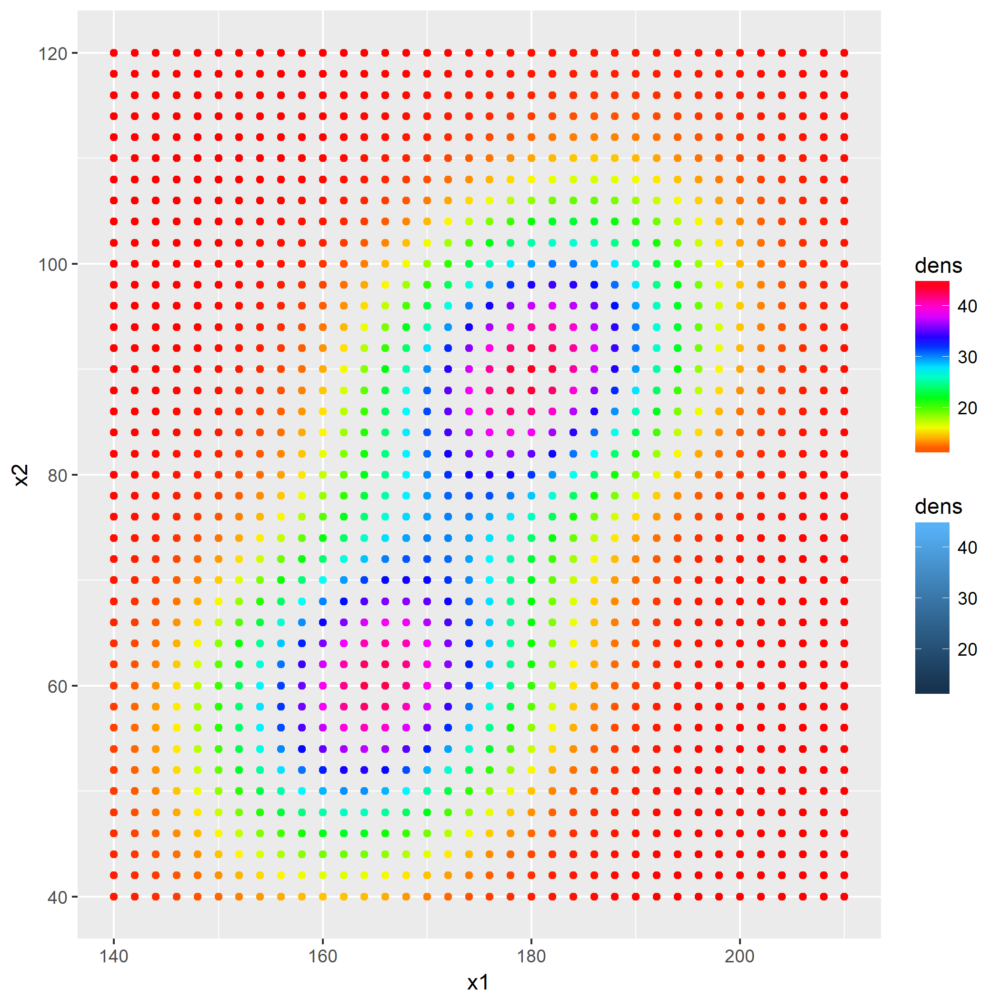
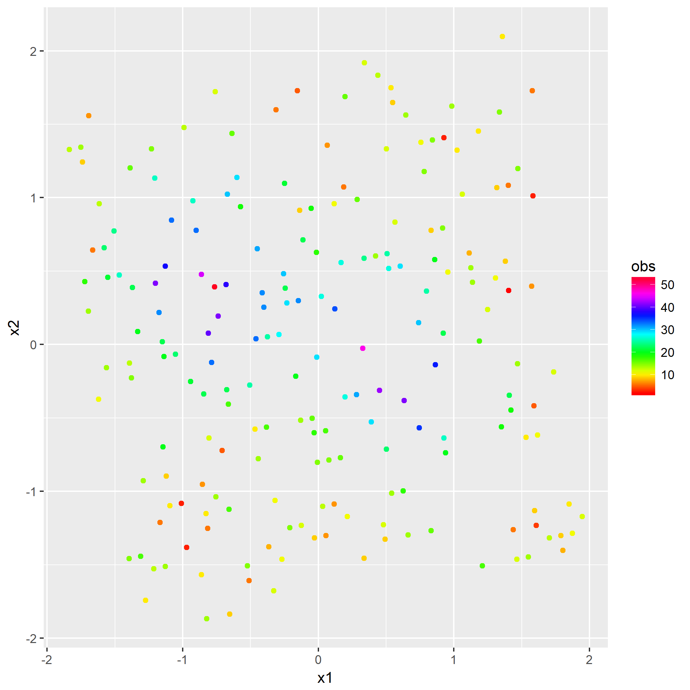
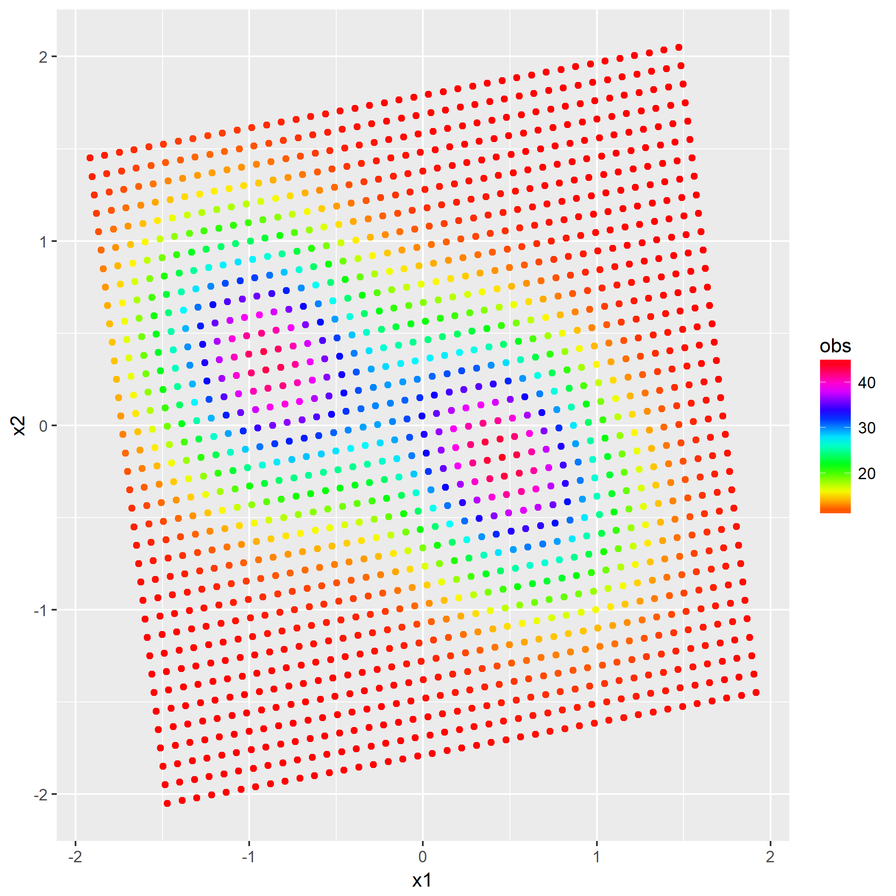

该章里面涉及一个的概念。

在解本章题目之后，笔者认为除了算法实现之外的全部知识属于线性代数以及坐标变换，虽然题目要求与[`PCA`](https://en.wikipedia.org/wiki/Principal_component_analysis)算法有些不一样，但是其涉及到的线性代数知识是共享的，故理解[白化](https://en.wikipedia.org/wiki/Whitening_transformation)过程之后，就很容易理解`PCA`了。

### 题目5.1 - 交叉验证

所用的[训练集](https://raw.githubusercontent.com/CFWLoader/supreme-bassoon/master/MachineIntelligence/datasets/TrainingRidge.csv)：
- 200个样本$(x^{(\alpha)},y^{(\alpha)})$，其中$x^{(\alpha)}=(x^{(\alpha)}_1, x^{(\alpha)}_2)^T$。

以及[验证集](https://raw.githubusercontent.com/CFWLoader/supreme-bassoon/master/MachineIntelligence/datasets/ValidationRidge.csv)：
- 1476个样本$(x^{(\beta)},y^{(\beta)})$，其中$x^{(\beta)}=(x^{(\beta)}_1, x^{(\beta)}_2)^T$为坐落在$36\times 41$图像的坐标信息。

第一问是将训练集以及验证集的数据白化后作图，首先画出白化前的数据分布：

在开始解题前已经介绍过白化过程了，于是直接贴出白化后的数据分布：

第二问是多项式展开，利用核函数将白化后的数据从`2维`升至更高维度，使得非线性问题在高维表示为线性问题。

所用的映射函数：

$$
\Phi(x)=(x_1^l x_2^m, ...), l\in[0, k],l+m = k
$$