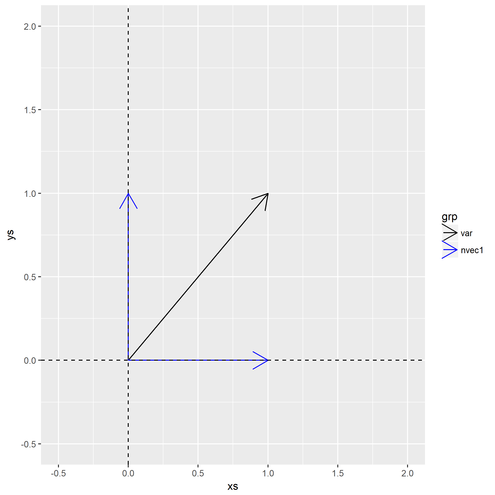

该章里面涉及一个[`Whitening`或`Shpering`](http://ufldl.stanford.edu/wiki/index.php/%E7%99%BD%E5%8C%96)的概念。

在解本章题目之后，笔者认为除了算法实现之外的全部知识属于线性代数以及坐标变换，虽然题目要求与[`PCA`](https://en.wikipedia.org/wiki/Principal_component_analysis)算法有些不一样，但是其涉及到的线性代数知识是共享的，故理解[白化](https://en.wikipedia.org/wiki/Whitening_transformation)过程之后，就很容易理解`PCA`了。

因为笔者本科时候没有好好认真学线性代数，所以到了这章费了不少时间，笔者假定大部分计算机专业的学生没有稳固的线代基础。

所以本章节内容会花很大章节从矩阵与坐标变化开始，讲到使用白化过程的原因，最后再解题。

### 知识基础
- [特征向量](https://en.wikipedia.org/wiki/Eigenvalues_and_eigenvectors)
- [标准正交基](https://en.wikipedia.org/wiki/Orthogonal_basis)

### 坐标变换与矩阵

大家熟知的标准`直角坐标系`就是以两个标准正交基$\vec{x}=(1,0)$以及$\vec{y}=(0,1)$构成的。

例如将一个$\vec{z}=(1,1)$分别投影到这两个基下的坐标：

