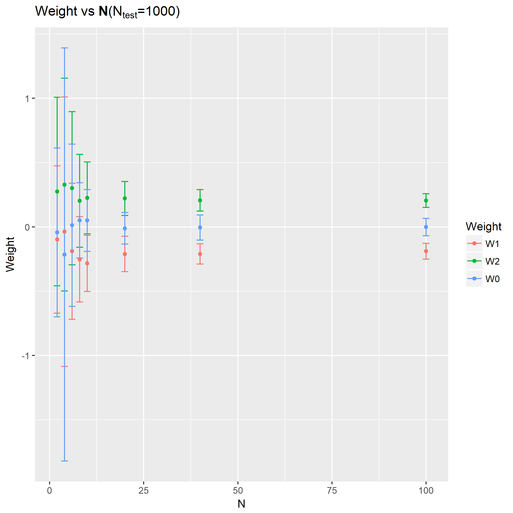

本章节是一些统计学习理论。

### 题目8.1 - Vapnik-Chervonenkis dimension，VC维

使用$\tilde{C}_{p,N}$的定义以及二项式的递归属性：

$$
(x+y)^n = \sum_{k=0}^{n}\left(\begin{matrix}n \\ k\end{matrix}\right)x^{n-k}y^k
$$

对于$x,y\in\mathbb{R},n\in\mathbb{N}$，证明一个线性分类器，$$y(x;w)=sign(w_0 + \sum_{i=1}^{N}x_i w_i)$$，其VC维$d_{VC}=N+1$。

记住，$$\tilde{C}_{(N+1,N)} = 2^{N+1}$$以及$$\tilde{C}_{(N+2,N)}<2^{N+2}$$。

显然笔者暂时不会证，或者网上已经有大堆博客，这题先放着。

### 题目8.2 - 分类可变性

假设样本$x^{(\alpha)}\in\mathbb{R}^2$分别属于两个聚类$C_1, C_2$，分别通过正态分布$\mathcal{N}(\mu_i, 2I),i=1,2$，其中$\mu_1 = (0,1)^T, \mu_2 = (1,0)^T$，$I$是单位阵。使用N个样本，测试一个线性神经元学习出来的模型的性能如何。按照如下步骤:

1. 对于两个聚类，分别产生$N/2$个数据点$x^{(\alpha)}$，当类属为$C_1$时，$y^{(\alpha)}=1$；当，当类属为$C_2$时，$y^{(\alpha)}=-1$。
2. 根据均方误差最小化，得出$y(x)=sign(w_0+\sum_{i=1}^{N}w_i x_i)$。
3. 产生根据同样的分布，每个类属产生500个测试样本。
4. 分别计算经验（训练）误差以及测试误差。

对于$N\in \{2,4,6,8,10,20,40,100\}$，分别重复50次，记下训练后的参数以及训练集的精度和测试集的精度。

第一问使用误差棒图描绘出每个N下的训练精度以及测试集精度均值和标准差：

可以看到训练样本越少，模型越容易过拟合，泛化性能越差，模型也不稳定（方差大）。

第二问分别绘出$w_0, w_1, w_2$关于N的误差棒图：

基本情况跟第一问一样，样本越少，重复中出来的参数误差越大。

### 题目8.3 - 二项分布

本题目涉及三个概率密度函数：

$$
\begin{align}
f(k;n,p)&=\left(\begin{matrix}n \\ k\end{matrix}\right)p^k(1-p)^{n-k} \\
f(x;\mu,\sigma)&=\frac{1}{\sigma\sqrt{2\pi}}e^{-\frac{(x-\mu)^2}{2\sigma^2}} \\
f(k;\lambda)&=\frac{\lambda^k}{k!}e^{-\lambda}
\end{align}
$$

第一个问题是通过不同$k,n,p$绘出函数图形。

第二个问题是什么条件下，可以合理使用正态分布近似二项分布。在$n\to\infty$时，正态分布可以近似表达。可以绘制一个样本图像来说明。

第三个问题是什么条件下，可以使用泊松分布来近似二项分布。当二项分布的$n$很大而p很小时，泊松分布可作为二项分布的近似，其中$\lambda$为$np$。通常当$n \ge 20,p \le 0.05$时，就可以用泊松公式近似得计算。同样也可以绘制一个示例来说明。

至此第八章的解题结束。