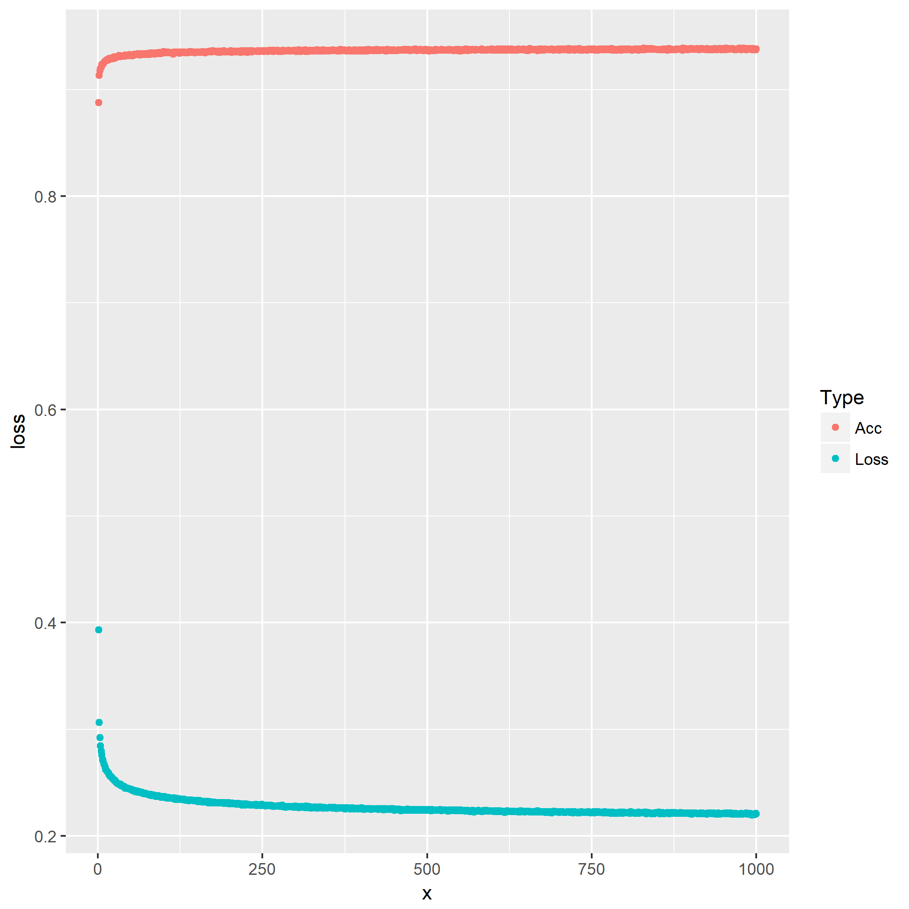

这章是为了让人体验深度神经网络而设置，根据题目要求组合出来的神经网络，进行一下训练，熟悉一下一般的机器学习科研（调参）流程。

因而笔者建议在这部分更加侧重于学习每种神经网络层的作用以及区别，例如`Loss`函数、激活函数、不同的梯度下降法对训练网络的影响。

常用的神经网络层有全连接层、循环层、卷积层以及经常配套出现的池化层等。

该章所用的数据集就是常用的`MNIST`手写数字数据集：

- 数据集每个样本都是`28*28`的矩阵存储，展开为一维向量时则有`784`个属性
- 样本的分类使用布尔值向量表示，如结果为`3`的$y_T=(0,0,0,1,0,0,0,0,0,0)^T$

第一问是使用经典的线性层来训练，其中参数：

- $f(x) = w^T x - \theta, w \in \mathbb{R}^{10, 784}, \theta \in \mathbb{R}^{10}$
- 学习率$\eta = 0.5$
- 使用`Cross Entropy`作为损失函数
- 随机梯度下降作为参数优化方法
- 数据批处理大小$mini-batch=100$，训练$10000~~epochs$

由于10000个Epochs对于笔者的个人电脑来说压力太大了，训练起来太久了，于是偷个懒设置成1000了，虽然可以使用GPU加速，但是这样会与笔者的GeForce驱动冲突，于是也懒得用cuDNN了。

训练过程中的精度和Loss变化：

第二问是使用三层线性成组成多层网络，参数：

- $f(x) = w^T x - \theta, w \in \mathbb{R}^{10, 1500}, \theta \in \mathbb{R}^{10}$
- 初始化$w_{i,j} \sim \mathcal{N}(0, 0.01^2)$
- $\theta_{i}=0.1$
- 每个隐藏层使用<a href="https://en.wikipedia.org/wiki/Rectifier_(neural_networks)">ReLU</a>作为激活函数
- 最后输出使用[Softmax](https://en.wikipedia.org/wiki/Softmax_function)作为激活函数
- 学习率$\eta=0.001$
- 参数优化使用[Adam](https://en.wikipedia.org/wiki/Stochastic_gradient_descent#Adam)算法
- $\beta_1 = 0.9,\beta_2=0.999,\epsilon=10^{-8}$，为优化器参数
- 数据批处理大小$mini-batch=100$，训练$20000~~epochs$

同样设置20个Epochs就好了，笔者电脑吃不消。

第三问在相邻的隐藏层间插入`Dropout`层，参数：

- 随机断开连接的几率设置为`0.5`

其余参数与上一问一样，重复实验。

第四问轮到大名鼎鼎的卷积层[CNN](https://en.wikipedia.org/wiki/Convolutional_neural_network)出场，这部分的参数较为复杂，所幸的是这里学习的问题在[TensorFlow官网](https://www.tensorflow.org/)上的配置基本是一致的。

参数方面，卷积层：

- 卷积核的大小为`5*5`，因为每张图像原始大小为`28*28`，经过卷积后变成了`24*24`
- 填充策略`padding='same'`
- `卷积层1`的`feature maps`为`32`，即参数`filter=32`，`卷积层2`则为`64`
- 默认使用`bias=TRUE`
- 使用`ReLU`作为激活函数

池化层采用最大池化层：

- 池化大小`pool_size=2`，事实上应该是`pool_size=c(2,2)`，代表每`2*2`局部图像抽取其中最大值成一个像素
- 跨幅`strides=2`，即每次池化后选取下一个池化区域的步长，例如池化大小为`2`时，第一次池化图像的坐标`(0,0),(0,1),(1,0),(1,1)`，那下一个为`(0,2),(0,3),(1,2),(1,3)`

损失函数使用交叉熵`Cross-Entropy`，`Adam`作为优化器。

最后一问就是比较前几问的模型，使用`100`个Epochs对比它们的效果，包括过拟合现象等比较，笔者在这里就不多介绍了，机器快烧了。

（实验结果图像后续补上）