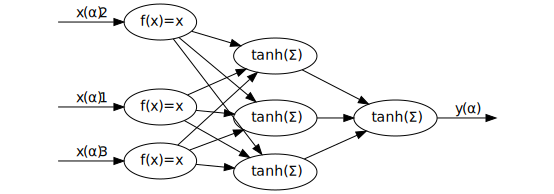
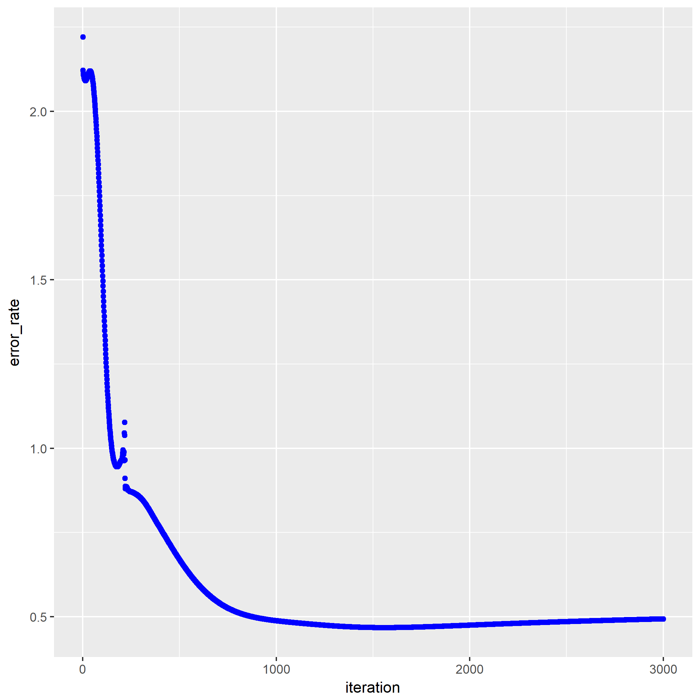
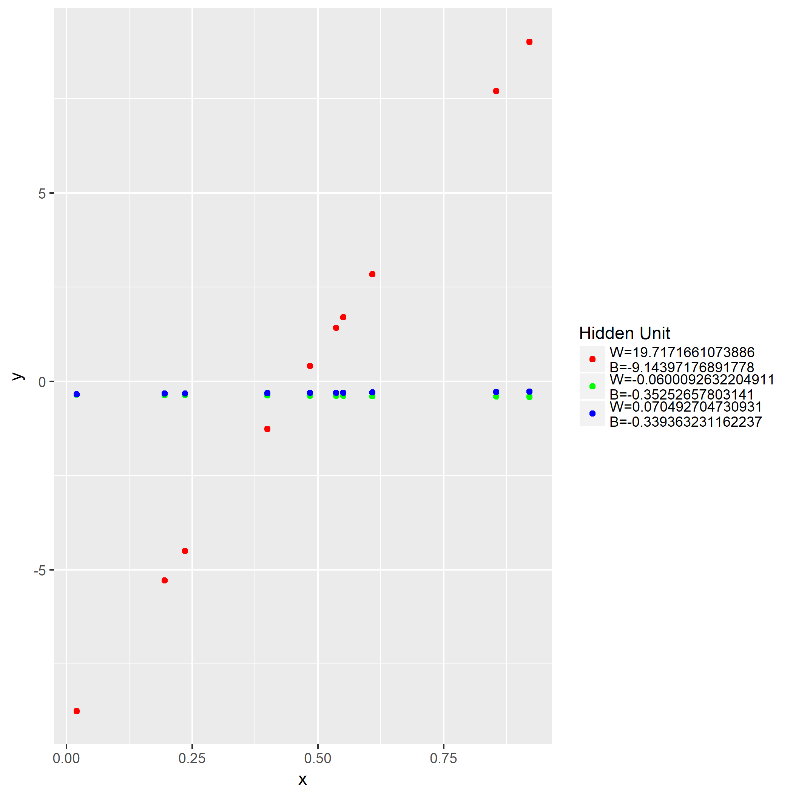
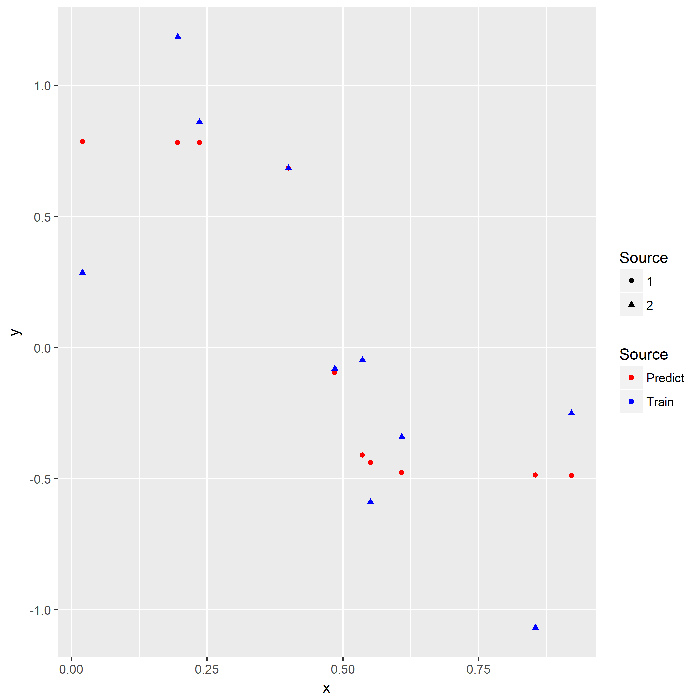

### 题目3.1 - 误差逆向传播公式推导

设$y_T^{(\alpha)} \in \{0, 1\}$为训练集的输出，$y(x;w)$为网络的输出，误差函数：

$$
E^T = \frac{1}{p} \sum_{\alpha = 0}^{p} e^{(\alpha)}
$$

其中：

$$
e^{(\alpha)} = - [y_T^{(\alpha)} ln y(x^{(\alpha)}; w) + (1 - y_T^{(\alpha)}) ln (1 - y(x^{(\alpha)}; w))]
$$

第一问求证：

$$
\frac{\partial e^{(\alpha)}}{\partial y(x^{(\alpha)}; w)} = \frac{y(x^{(\alpha)}; w) - y_T^{(\alpha)}}{y(x^{(\alpha)}; w)(1 - y(x^{(\alpha)}; w))}
$$

这些符号里面的上下标太让人眼花了，笔者首先用其他符号代表一下：

$$
\begin{align}
e & = e^{(\alpha)} \\
a & = y(x^{(\alpha)}; w) \\
b & = y_T^{(\alpha)}
\end{align}
$$

那么条件就变成了：

$$
e = -[b ln a + (1 - b)ln(1 - a)]
$$

问题就变成了：

$$
\frac{\partial e}{\partial a} = \frac{a - b}{a(1-a)}
$$

开始求解：

$$
\begin{align}
\frac{\partial e}{\partial a} & = \frac{\partial -[b ln a + (1 - b)ln(1 - a)]}{\partial a} \\
& = [-\frac{b}{a} + \frac{1 - b}{1 - a}] \\
& = \frac{-b + ab + a - ab}{a(1 - a)} \\
& = \frac{a - b}{a(1 - a)}
\end{align}
$$

证之。

第二问，有如下函数：

$$
f(h_1^2) = \frac{1}{1+e^{-h_1^2}}
$$

其中$h_1^2$为第一层到第二层的总输入，求证：

$$
f'(h_1^2) = f(h_1^2)(1 - f(h_1^2))
$$

这个求导基本上就是在考本科学过的求导知识,同样先简化符号$x = h_1^2$：

$$
\begin{align}
f'(x) & = (\frac{1}{1+e^{-x}})' \\
& = - \frac{(1+e^{-x})'}{(1+e^{-x})^2} \\
& = \frac{e^{-x}}{(1+e^{-x})^2} \\
& = \frac{e^{-x}}{(1+e^{-x})} \frac{1}{1+e^{-x}} \\
& = \frac{1}{1+e^{-x}} \frac{(1 + e^{-x}) - 1}{(1+e^{-x})} \\
& = f(x)(1-f(x))
\end{align}
$$

证之。

结合前两问，证明：

$$
\frac{\partial e^{(\alpha)}}{\partial w_{1j}^{21}} = (y(x^{(\alpha)}; w) - y_T^{(\alpha)})S_j^1
$$

其中$w_{1j}^{21}$是第一层（隐藏层）的第$j$个神经元到第二层（输出层）的第一个神经元的权重，$S_j^1$是第一层的第$j$个神经元的输出。

这里的符号一样混乱，但是在简化符号代表之前首先展开并理清：

$$
\frac{\partial e^{(\alpha)}}{\partial w_{1j}^{21}} = \frac{\partial e^{(\alpha)}}{\partial y(x^{(\alpha)}; w)} \frac{\partial y(x^{(\alpha)}; w)}{\partial h_1^2} \frac{\partial h_1^2}{\partial w_{1j}^{21}}
$$

因为机器学习里面的一般方法就是设定一个误差函数，然后使得误差函数最小化，其中一个重要的方法就是求导，通过导数找到极小值点。

理解这样的展开技巧是很有必要的，因为这里是一层（隐藏层到输出层）的求导，稍后误差函数关于输入层的权重的偏导数也要进行类似的展开。

根据上式以及第一问求得的$\frac{\partial e^{(\alpha)}}{\partial y(x^{(\alpha)}; w)} = \frac{y(x^{(\alpha)}; w) - y_T^{(\alpha)}}{y(x^{(\alpha)}; w)(1 - y(x^{(\alpha)}; w))}$，简化表示$\frac{\partial e}{\partial a} = \frac{a - b}{a(1 - a)}$。

$$
\frac{\partial y(x^{(\alpha)}; w)}{\partial h_1^2} = f'(h_1^2) 
$$

而函数$f$为第二问提及的函数，利用结论可得：

$$
\frac{\partial y(x^{(\alpha)}; w)}{\partial h_1^2} = f(h_1^2)(1-f(h_1^2)) = y(x^{(\alpha)}; w)(1-y(x^{(\alpha)}; w))
$$

简化表示为$a(1-a)$：

剩下的

$$
\frac{\partial h_1^2}{\partial w_{1j}^{21}}
$$

注意到：

$$
h_1^2 = \sum_{j=1}^{N} w_{1j}^{21}S_j^1
$$

其中$N$为隐藏层的神经元个数。

故可以求得：

$$
\frac{\partial h_1^2}{\partial w_{1j}^{21}} = S_j^1
$$

所以：

$$
\frac{\partial e^{(\alpha)}}{\partial y(x^{(\alpha)}; w)} = \frac{a - b}{a(1 - a)} a(1-a) S_j^1 = (a-b)S_j^1
$$

证之。

### 题目3.2 - MLP回归

首先先观察MLP的结构：

在前面一题得到了隐藏层的权重更新公式：

$$
\frac{\partial e^{(\alpha)}}{\partial w_{1j}^{21}} = (y(x^{(\alpha)}; w) - y_T^{(\alpha)})S_j^1
$$

在开始求解问题之前，需要得知输入层的更新公式，仿照上一题的推导过程，有：

$$
\begin{align}
\frac{\partial e^{(\alpha)}}{\partial w_{ji}^{10}} & = \frac{\partial e^{(\alpha)}}{\partial y(x^{(\alpha)}; w)} \frac{\partial y(x^{(\alpha)}; w)}{\partial h_1^2} \frac{\partial h_1^2}{\partial S_j^1} \frac{\partial S_j^1}{\partial h_j^1} \frac{\partial h_j^1}{\partial w_{ji}^{10}} \\
& = \frac{y(x^{(\alpha)}; w) - y_T^{(\alpha)}}{y(x^{(\alpha)}; w)(1 - y(x^{(\alpha)}; w))} y(x^{(\alpha)}; w)(1-y(x^{(\alpha)}; w)) \frac{\partial h_1^2}{\partial S_j^1} \frac{\partial S_j^1}{\partial h_j^1} \frac{\partial h_j^1}{\partial w_{ji}^{10}} \\ 
& = [y(x^{(\alpha)}; w) - y_T^{(\alpha)}] \frac{\partial h_1^2}{\partial S_j^1} \frac{\partial S_j^1}{\partial h_j^1} \frac{\partial h_j^1}{\partial w_{ji}^{10}} \\
& = [y(x^{(\alpha)}; w) - y_T^{(\alpha)}] w^{21}_{1j} f'(h_j^1) \frac{\partial h_j^1}{\partial w_{ji}^{10}} \\
& = [y(x^{(\alpha)}; w) - y_T^{(\alpha)}] \sum_{j=1}\{w^{21}_{1j} S_j^1[1 - S_j^1]\} x^{(\alpha)}_i
\end{align}
$$

其中$\frac{\partial e^{(\alpha)}}{\partial y(x^{(\alpha)}; w)}, \frac{\partial y(x^{(\alpha)}; w)}{\partial h_1^2}$已有上述结论推导出。

而：

$$
\frac{\partial h_1^2}{\partial S_j^1} = (w^{21}_{1j} S_j^1 + \mathbf{bias})' = w^{21}_{1j}
$$

隐藏层的输出为$S_j^1$，输入为$h_j^1$，因为默认用`Sigmoid`为激活函数，于是有：

$$
\frac{\partial h_1^2}{\partial S_j^1} = f'(h_j^1) =  S_j^1(1 - S_j^1)
$$

对于输入层，显然：

$$
\frac{\partial h_j^1}{\partial w_{ji}^{10}} = (w_{ji}^{10} x^{(\alpha)}_i + \mathbf{bias})' = x^{(\alpha)}_i
$$

事实上对于题目的一层隐藏层，这样推导出来的`误差逆传播`公式基本上算是解决了问题了，若是有更多的隐藏层，无非就是根据这样的`链式法则`从最终输出层推导到输入层而已。

介绍完要用到的公式，那么就开始解题。

题目是构建一个单层隐藏层的MLP，使用`tanh`函数作为转移函数，拟合$sin(2\pi x)$函数。

笔者偷了个懒，把MLP按照如下结构构建：

将细节完整表示：

这个时候，输入层的权重更新公式变为:

$$
\frac{\partial e^{(\alpha)}}{\partial w_{ii}^{10}} = [y(x^{(\alpha)}; w) - y_T^{(\alpha)}] w^{21}_{1i} S_i^1[1 - S_i^1] x^{(\alpha)}_i
$$

各部分更新值传递在网络中的体现：

事实上到了这里，我们基本上算是解决了这个问题，剩下的就是具体编码了，笔者的实现在[Github](https://github.com/CFWLoader/supreme-bassoon/blob/master/MachineIntelligence/e3/e3-2abc.R)

解题所使用的[数据集](https://raw.githubusercontent.com/CFWLoader/supreme-bassoon/master/MachineIntelligence/datasets/RegressionData.txt)

第一问是输出训练过程中误差变化：

可以看到笔者用了3000次迭代。

第二问是画出训练后3个隐藏层各自的输出：

第三问是画出训练用的输出以及训练好的网络对于样本的输出：

至于最后两问仅仅是把上面三问重复一边，对比差异，以及解释差异而已。

至此本节的解题结束。