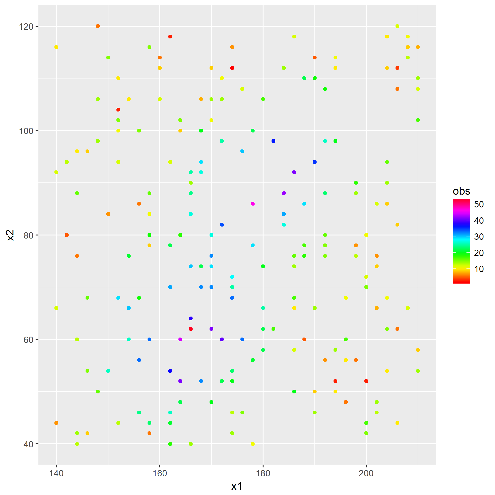
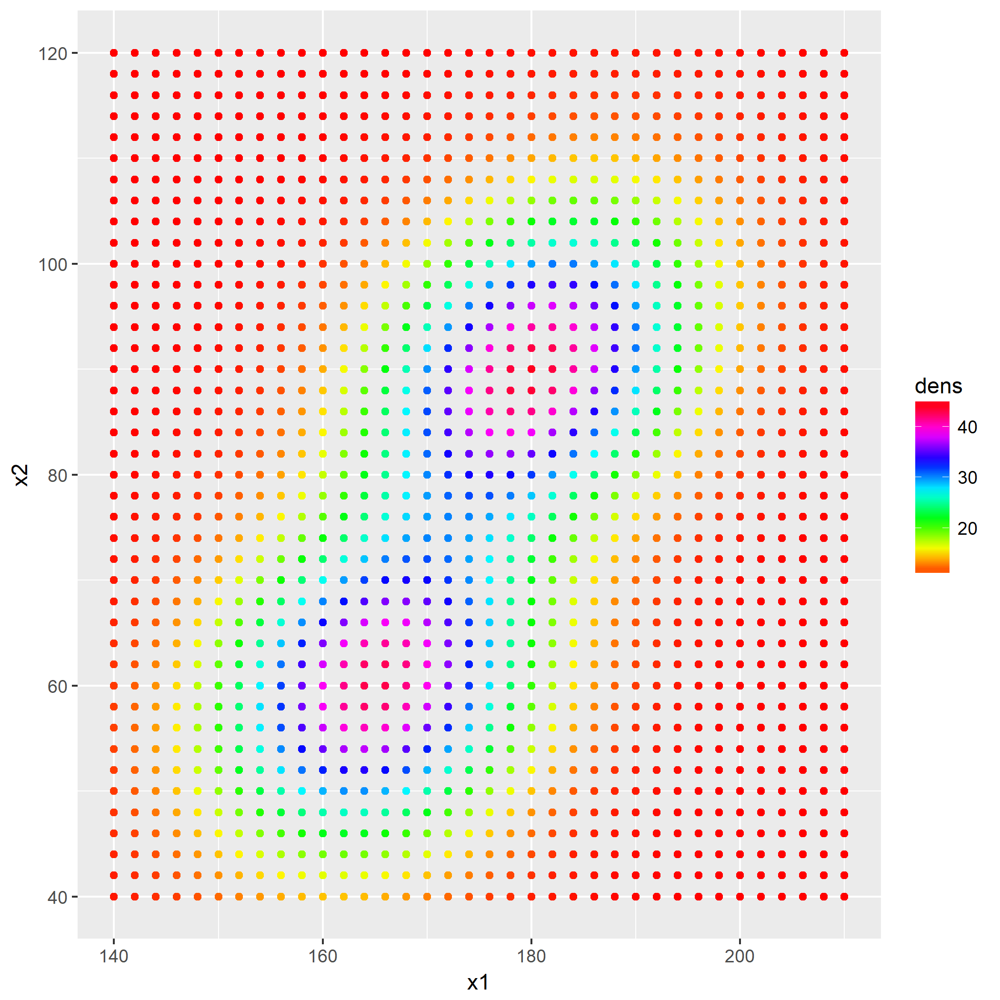
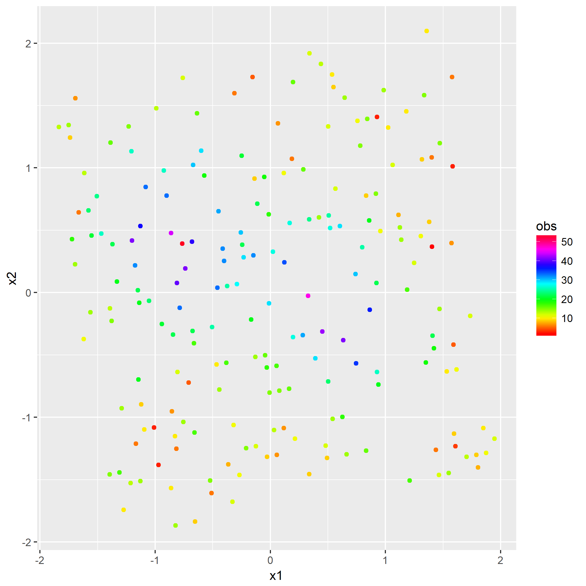
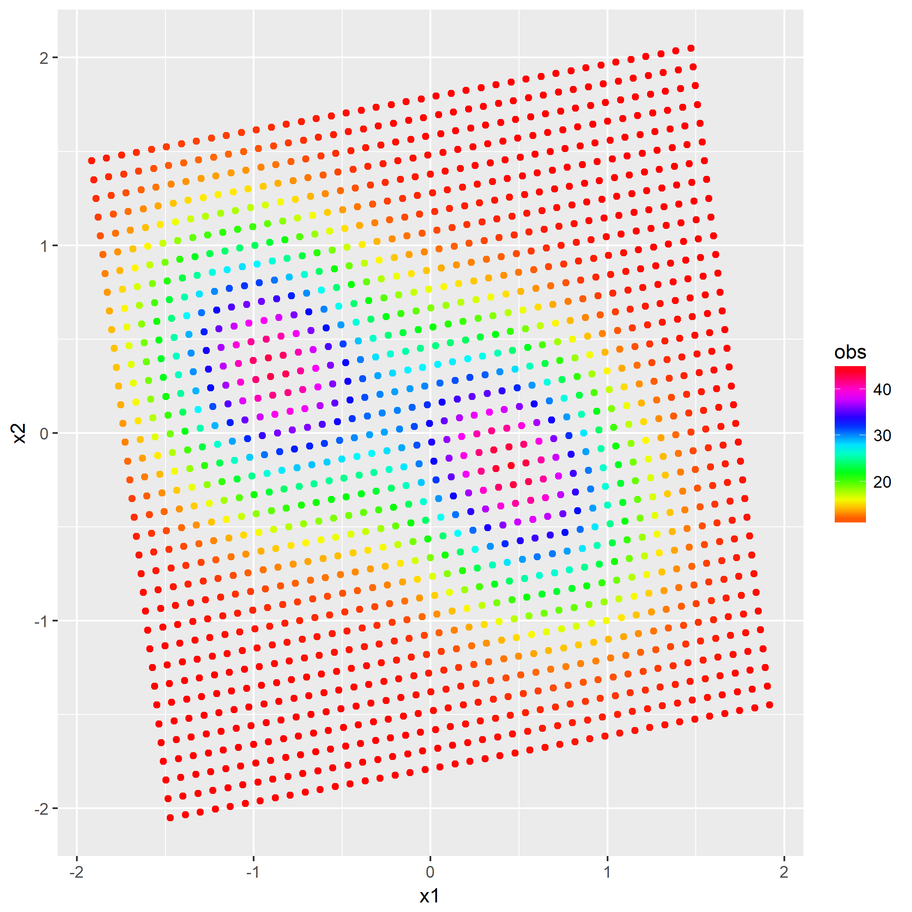
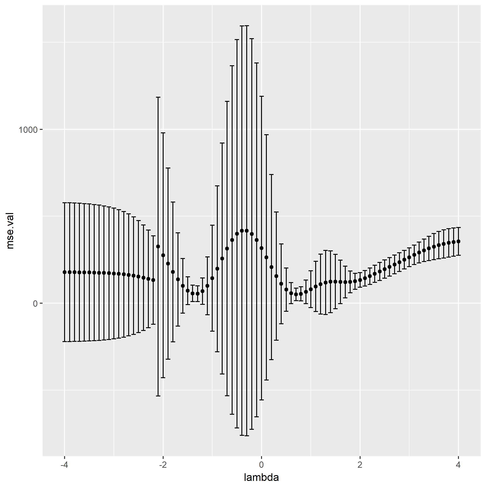
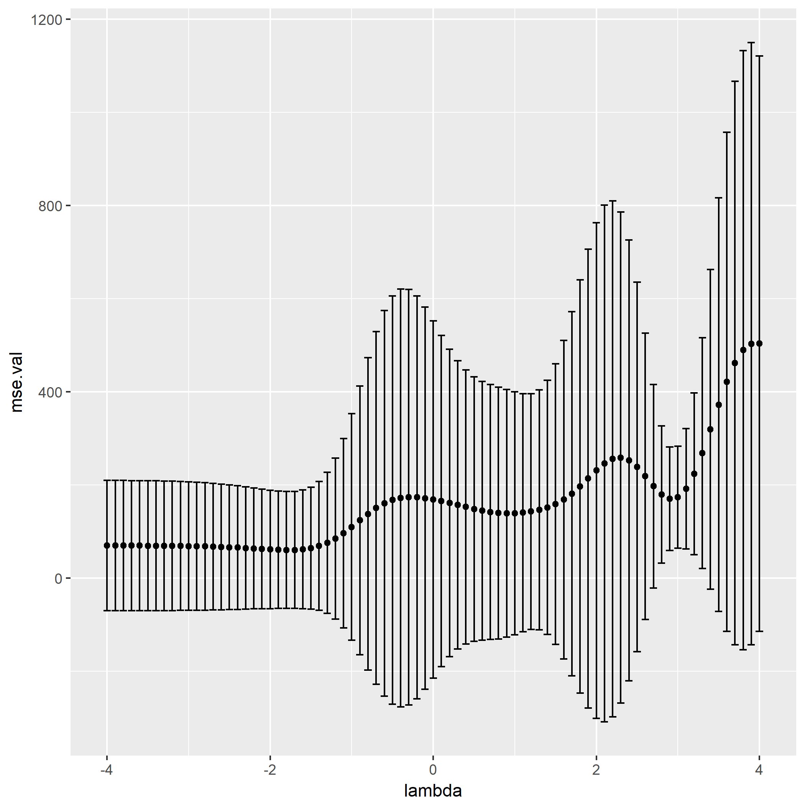

该章里面涉及一个的概念。

在解本章题目之后，笔者认为除了算法实现之外的全部知识属于线性代数以及坐标变换，虽然题目要求与[`PCA`](https://en.wikipedia.org/wiki/Principal_component_analysis)算法有些不一样，但是其涉及到的线性代数知识是共享的，故理解[白化](https://en.wikipedia.org/wiki/Whitening_transformation)过程之后，就很容易理解`PCA`了。

### 题目5.1 - 交叉验证

所用的[训练集](https://raw.githubusercontent.com/CFWLoader/supreme-bassoon/master/MachineIntelligence/datasets/TrainingRidge.csv)：
- 200个样本$(x^{(\alpha)},y^{(\alpha)})$，其中$x^{(\alpha)}=(x^{(\alpha)}_1, x^{(\alpha)}_2)^T$。

以及[验证集](https://raw.githubusercontent.com/CFWLoader/supreme-bassoon/master/MachineIntelligence/datasets/ValidationRidge.csv)：
- 1476个样本$(x^{(\beta)},y^{(\beta)})$，其中$x^{(\beta)}=(x^{(\beta)}_1, x^{(\beta)}_2)^T$为坐落在$36\times 41$图像的坐标信息。

第一问是将训练集以及验证集的数据白化后作图，首先画出白化前的数据分布：

在开始解题前已经介绍过白化过程了，于是直接贴出白化后的数据分布：

第二问是多项式展开，利用核函数将白化后的数据从`2维`升至更高维度，使得非线性问题在高维表示为线性问题。

所用的映射函数：

$$
\phi(x)=(x_1^l x_2^m, ...), l\in[0, k],l+m = k, k = 0, 1, ..., n
$$

例如当$k=9$时，可以产生`55`项这样的单项式，根据该映射函数，所用的预测方程为：

$$
y(x;w)=w^T x, w = (\Phi^T \Phi)^{-1}\Phi^T y^T
$$

而$\Phi=\phi(x)$。

然而本题要输出的是各单项式的值，例如当$k=3$的时候，本题要求画出前10个单项式的值，这会产生10张图。

$y=f(x_1, x_2) = x_1^l x_2^m$，即在前10个$l,m$的组合中每对$x=(x_1, x_2)$对应的值，绘图。

笔者懒得去画了，毕竟用`ggplot`将多张图片放在一个输出文件中有点麻烦，读者可以挑其中一个，如$f(x_1, x_2) = x_1^2 x_2^1$，以$x=x_1,y=x_2,z=f(x_1,x_2)$来绘出热度图。

第三问引入[正则化](https://en.wikipedia.org/wiki/Regularization_%28mathematics%29)来降低过拟合，这里用了[L1正则化](https://www.jianshu.com/p/a47c46153326)：

$$
y(x;w)=w^T x, w = (\Phi^T \Phi - \lambda I)^{-1}\Phi^T y^T
$$

其中$I$为单位矩阵，尝试$\lambda \in \{10^z | z = -4, -3.9, ..., 3.9, 4\}$不同的值对过拟合的影响，画出不同$\lambda$的平均方误差以及平均方误差的方差：

可以看到$\lambda_T=10^{0.7} \approx 5.011872$附近对于训练集正则化效果最好。

最后一问是试出对于验证集最好的$\lambda_G$，与$\lambda_T$比较一下：

然后最佳的$\lambda_G = 10^{-1.7} \approx 0.01995262$，显然与$\lambda_T$不同。

至此第五章题解完毕。