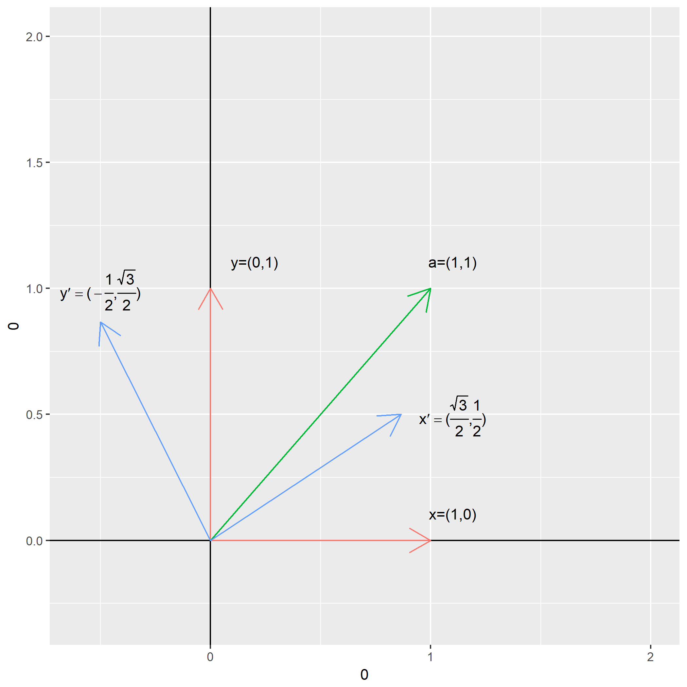
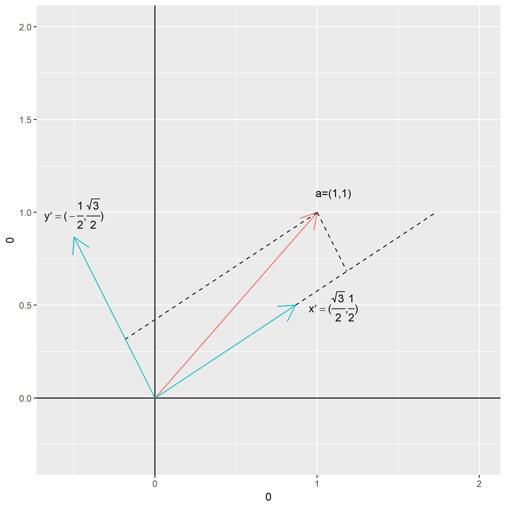
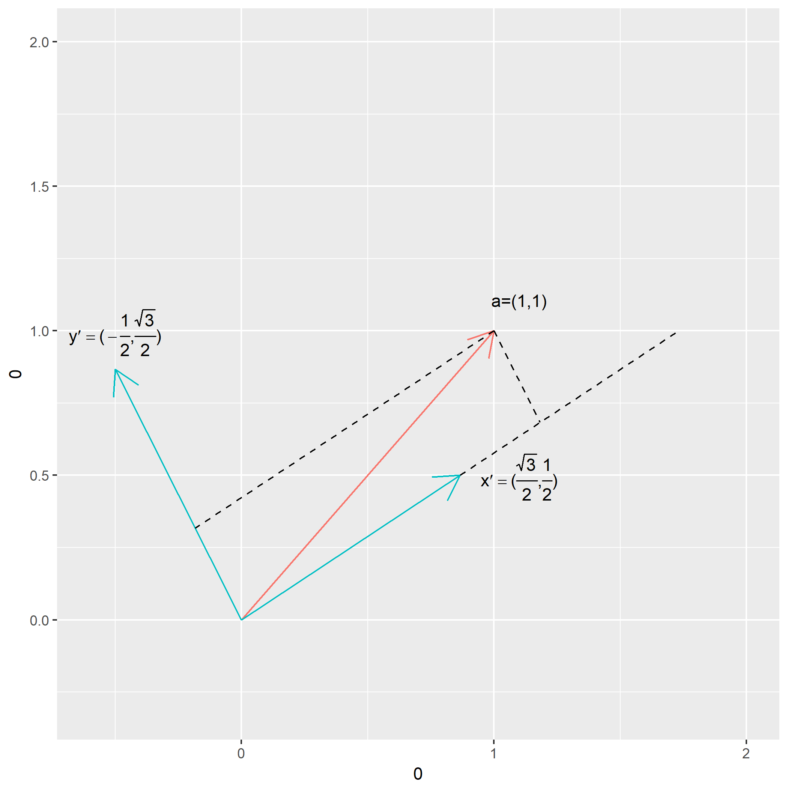
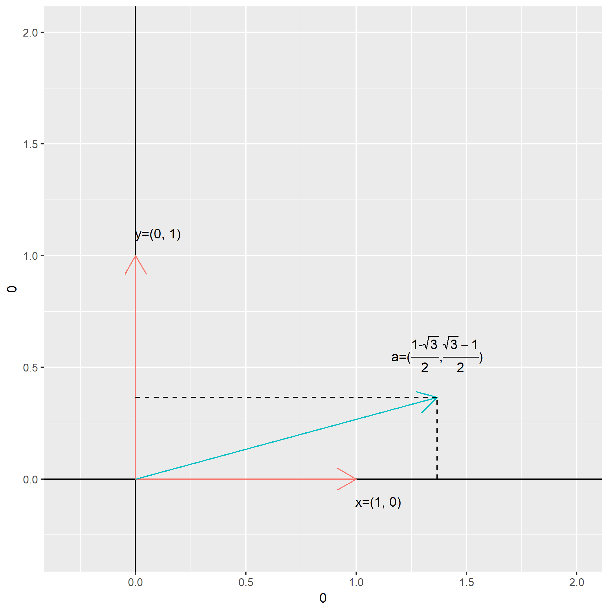

相信本科时候没有好好学线性代数的同学会对：

$$
\left[
    \begin{matrix}
    a & b \\
    c & d
    \end{matrix}
\right]
\left[
    \begin{matrix}
    x \\
    y
    \end{matrix}
\right]
=
\left[
    \begin{matrix}
    x' \\
    y'
    \end{matrix}
\right]
$$

这样的一个矩阵乘法之后，原坐标下的向量坐标$(x,y)$就会变成了新坐标下的向量坐标$(x',y')$，多少会感觉到一些突然。

笔者在此复习一边这样的矩阵乘法与坐标变换的关系。

好了，从熟悉$X-Y$坐标系开始，假设我们在这个坐标下有一个向量$\vec{a}=(1,1)$：

事实上图中的坐标系是由一组[标准正交基](https://en.wikipedia.org/wiki/Orthogonal_basis)$\vec{x}=(1,0)$和$\vec{y}=(0,1)$构成的。计算一个向量在一组基下的坐标是分别用该向量与每个基作点乘（投影），得到向量在每个基下的投影长度。

例如计算$\vec{a}$就是分别计算$\vec{a}\cdot\vec{x}$与$\vec{a}\cdot\vec{y}$的值。

那么将向量的形式换成用线性代数一般的表示形式：

$$
\begin{align}
\vec{a} = [1 ~~ 1] \\
\vec{x} = [1 ~~ 0] \\
\vec{y} = [0 ~~ 1]
\end{align}
$$

那么坐标系变换的过程可以表示为如下的矩阵运算：

$$
\left[
    \begin{matrix}
    \vec{x} \\
    \vec{y}
    \end{matrix}
\right]
\left[
    \begin{matrix}
    \vec{a}^T
    \end{matrix}
\right]
=
\left[
    \begin{matrix}
    1 & 0 \\
    0 & 1
    \end{matrix}
\right]
\left[
    \begin{matrix}
    1 \\
    1
    \end{matrix}
\right]
=
\left[
    \begin{matrix}
    1 \\
    1
    \end{matrix}
\right]
$$

矩阵运算与坐标变换就这样联系起来了，当然这里全都设置为$1$的值，当然看不出变换在哪里了，这里开始从原来的$\vec{x}, \vec{y}$组成的$X-Y$坐标系开始作变换：

假设有一组新的标准正交基$\vec{x}'=[\frac{\sqrt{3}}{2} ~~ \frac{1}{2}], \vec{y}'=[-\frac{1}{2} ~~ \frac{\sqrt{3}}{2}]$，容易验证：

$$
\vec{x}' \cdot \vec{y}' = 0, |\vec{x}'| = |\vec{y}'| = 1
$$

新标准正交基加入后，作图如下：

计算原向量在新坐标系（基底）下的坐标（各基底下的投影长度）如下：

$$
\begin{align}
\vec{x}' \cdot \vec{a} = \vec{x}' \times \vec{a}^T = [\frac{\sqrt{3}}{2} ~~ \frac{1}{2}] [1 ~~ 1]^T = \frac{\sqrt{3} + 1}{2} \\
\vec{y}' \cdot \vec{a} = \vec{y}' \times \vec{a}^T = [-\frac{1}{2} ~~ \frac{\sqrt{3}}{2}] [1 ~~ 1]^T = \frac{\sqrt{3} - 1}{2}
\end{align}
$$

写成矩阵表示：

$$
\left[
    \begin{matrix}
    \vec{x}' \\
    \vec{y}'
    \end{matrix}
\right]
\vec{a}^T
=
\left[
    \begin{matrix}
    \frac{\sqrt{3}}{2} & \frac{1}{2} \\
    -\frac{1}{2} & \frac{\sqrt{3}}{2}
    \end{matrix}
\right]
\left[
    \begin{matrix}
    1 \\
    1
    \end{matrix}
\right]
=
\left[
    \begin{matrix}
    \frac{\sqrt{3} + 1}{2} \\
    \frac{\sqrt{3} - 1}{2}
    \end{matrix}
\right]
$$

抹去原来的坐标线，只看新基底与被投影的向量：

把头倾斜一下，就看到形成的新坐标系：

注意新基底$\vec{x}', \vec{y}'$在变成了新坐标$(1,0),(0,1)$，因为他们自己投影自己后的长度都为$1$，并且正交，在对方的投影值都为$0$。读者可以试试用投影定义式计算图中向量在新坐标系下的坐标值。

对于$n$个标准正交基组成的向量空间，其坐标变换可以表示为矩阵运算：

$$
\left[
    \begin{matrix}
    \vec{v}_1 \\
    \vec{v}_2 \\
    ... \\
    \vec{v}_n
    \end{matrix}
\right]
\vec{x}^T
=
\left[
    \begin{matrix}
    \vec{v}_1 \\
    \vec{v}_2 \\
    ... \\
    \vec{v}_n
    \end{matrix}
\right]
\left[
    \begin{matrix}
    x_1 \\
    x_2 \\
    ... \\
    x_n
    \end{matrix}
\right]
$$

其中$\vec{v}_1,\vec{v}_2,...,\vec{v}_n$与$\vec{x}$为原`N维空间`下的坐标向量，长度为`n`。

当需要表示更加复杂的变换，例如2维空间下，需要平移操作，这个时候增加一维信息，具体有兴趣的读者可以到网上了解。

至此，又复习了一课线性代数。

（未完待续）