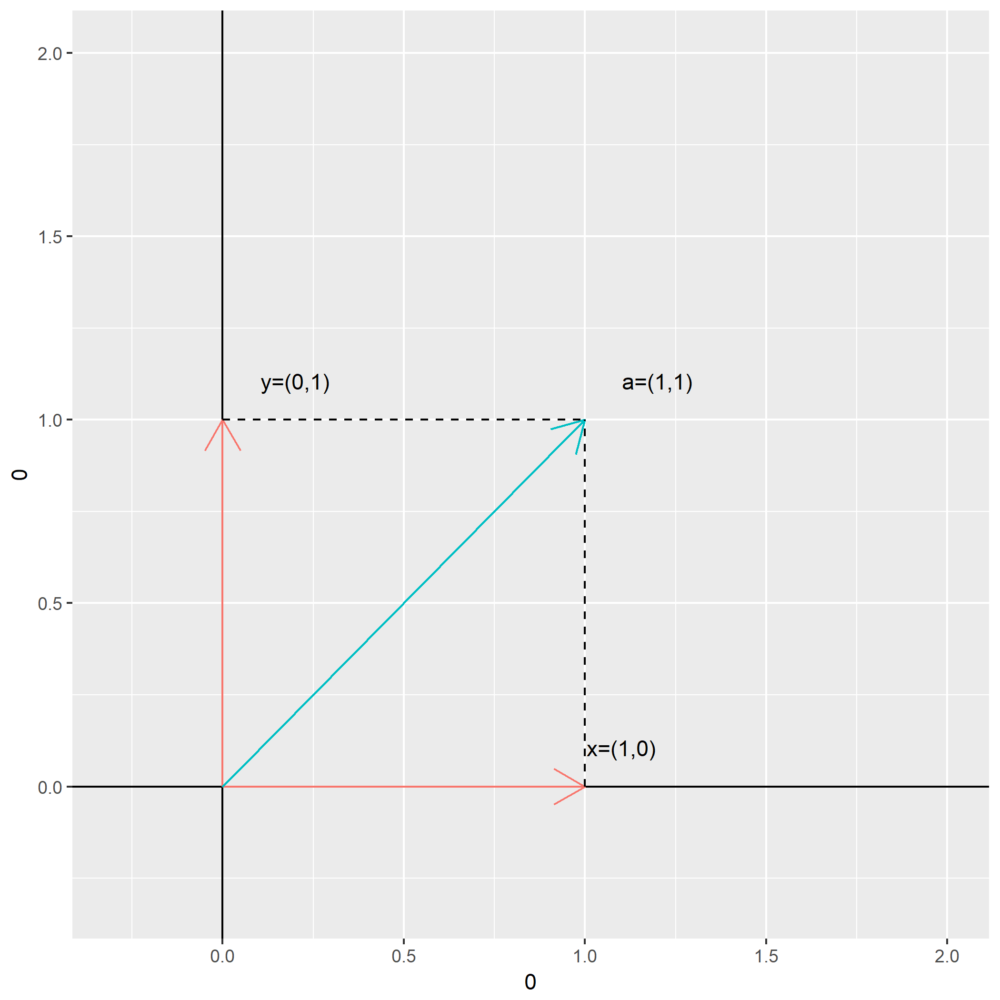

相信本科时候没有好好学线性代数的同学会对：

$$
\left[
    \begin{matrix}
    a & b \\
    c & d
    \end{matrix}
\right]
\left[
    \begin{matrix}
    x \\
    y
    \end{matrix}
\right]
=
\left[
    \begin{matrix}
    x' \\
    y'
    \end{matrix}
\right]
$$

这样的一个矩阵乘法之后，原坐标下的向量坐标$(x,y)$就会变成了新坐标下的向量坐标$(x',y')$，多少会感觉到一些突然。

笔者在此复习一边这样的矩阵乘法与坐标变换的关系。

好了，从熟悉$X-Y$坐标系开始，假设我们在这个坐标下有一个向量$\vec{a}=(1,1)$：

（未完待续）