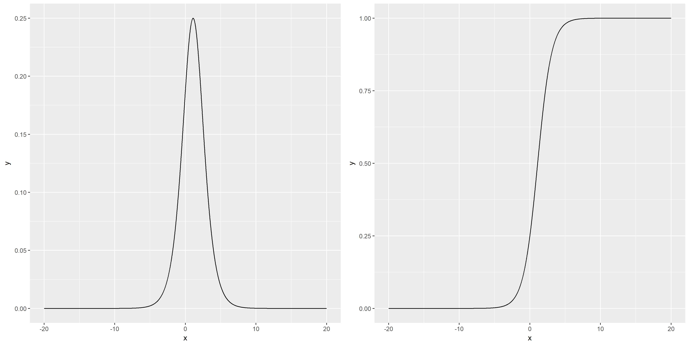

逻辑斯谛回归模型（Logistic Regression，以下简称LR）是统计学习中的经典分类方法。读过《统计学习方法》之后，笔者才知道该模型是一种`概率分布模型`，从此理解为何该模型不但可以预测分类，还可以预测属于该类的概率。

遵循

## 逻辑斯谛分布

设$X$是连续随机变量，若$X$服从逻辑斯谛分布，则有如下分布函数和密度函数：

$$
\begin{aligned}
F(x) = P(X \leq x) & = \frac{1}{1 + e^{-(x-\mu)/\gamma}} \\
f(x) = F\prime (x) & = \frac{e^{-(x-\mu)/\gamma}}{\gamma(1 + e^{-(x-\mu)/\gamma})^2}
\end{aligned}
$$

下面两张是$\mu = 1.1$时的概率密度分布以及累计概率分布：

可以看到PDF关于Y轴对称，CDF关于$(\mu, \frac{1}{2})$对称。

曲线在中心附近增长速度较快，在两端增长速度较慢。形状参数$\gamma$越小，曲线在中心附近增长越快。

## 二项逻辑斯谛回归模型

二项逻辑斯谛回归模型（Binomial Logistic Regression Model）是一种`分类模型`，由条件概率分布$P(Y|X)$表示，随机变量$Y$取值0或1，$X\in \mathbb{R}^n$。

故二项逻辑斯谛回归模型是如下的条件概率分布：

$$
\begin{aligned}
P(Y=1|x) & = \frac{\exp(w\cdot x + b)}{1 + \exp(w\cdot x + b)} \\
P(Y=0|x) & = \frac{1}{1 + \exp(w\cdot x + b)}
\end{aligned}
$$

（未完待续）